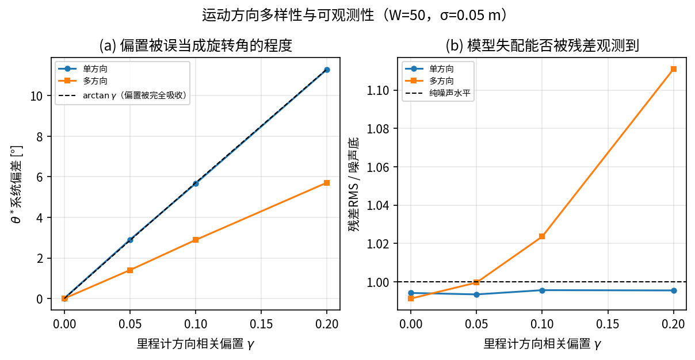
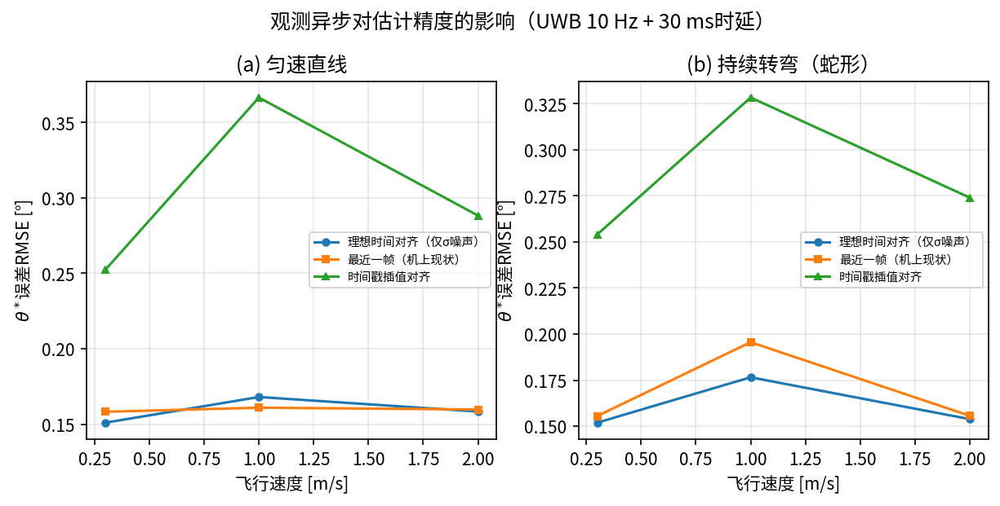
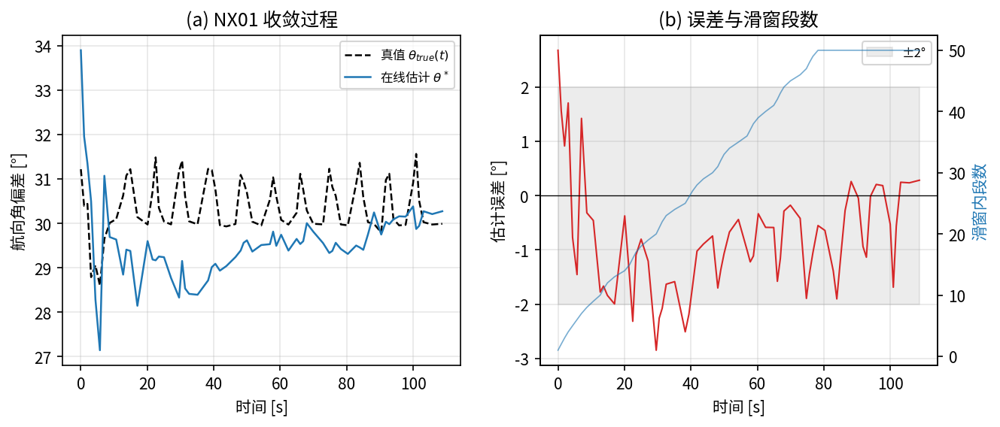
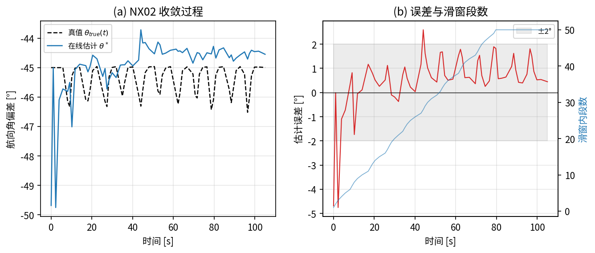

## 4 实验与验证

本章分两个层次验证第2、3节的方法与结论：4.2节用蒙特卡洛数值实验直接检验各条解析结论，4.3、4.4节在双机协同无人机容器化仿真平台上做闭环验证；4.5节给出与现有方法的比较，4.6节报告真机侧方法族的泛化验证。

### 4.1 实验设置

数值实验按第2节的观测模型合成数据：给定真值航向角偏差$\theta_{0}$，按式(1)生成局部位移段$u_{i}$，经$R(\theta_{0})$旋转后叠加观测噪声得到$v_{i}$，再送入与机载实现完全相同的分段、滑窗累加与式(7)读数流程。除非另行说明，参数取表1的标称值：$\sigma = 0.05\, m$、$d_{\min} = 0.5\, m$、$W = 50$、$\theta_{0} = 30{^\circ}$，每个配置重复2000次独立试验（含时序过程的实验分别取30至1000次）。

仿真实验在双机协同无人机容器化仿真平台上进行。平台以Gazebo Classic提供世界真值与传感器仿真，PX4 SITL提供飞控闭环，局部位姿由激光惯性里程计DLIO提供，绝对位置观测由仿真节点在世界真值上叠加零均值高斯噪声产生（$\sigma = 0.05\, m$），两机预设航向角默认分别为$30{^\circ}$与$-45{^\circ}$，出生点相距3 m。每次实验的流程为：静止状态下触发一次平移锚点标定，起飞至1 m悬停，随后在各自局部坐标系内沿边长3 m的正方形航线飞行3圈（累计路径36 m，足以填满$W = 50$的滑窗），全程录制原始数据流离线复算。评估真值取自仿真世界状态，逐时刻计算$\theta_{true}(t) = \psi_{world}(t) - \psi_{odom}(t)$，即把局部里程计自身的航向漂移也计入评估基准，而不是固定采用出生时的预设角度。

离线复算工具复刻机载节点的分段与滑窗逻辑，其可信性由两条独立证据支撑：一是在含10%野值的同一组输入上，机载实现与离线副本给出的$\theta^{\ast}$差异小于$10^{-12}\, rad$；二是离线复算在实测数据上重建出的$\theta^{\ast}$末值与机载节点当时实际发布的诊断值逐位一致（如第4.3.1节首次实验的$30.273{^\circ}$与$-44.544{^\circ}$）。

关于仿真平台，有三点会影响结论解读，需要明确说明。其一，仿真中"更新率"配置值不等于真实发布频率，需乘以仿真实时因子，该因子在双机高负载场景下实测在0.27–0.53之间波动，因此本文涉及"多长时间收敛"的结论同时给出"收敛时已累积多少段位移"这一与平台速率无关的度量。其二，本平台绝对位置观测的发布路径直接挂在世界状态回调上，实际发布率等于世界状态插件的更新率（100 Hz仿真时间）且不经过时延队列，比真实超宽带模块（典型10–50 Hz、数十毫秒时延）乐观，因此仿真闭环给出的精度应视为观测条件充分时的结果。其三，本平台中两路观测甚至不共享同一时钟域：局部里程计运行在仿真时钟上，绝对观测节点使用宿主机墙钟，二者的时间戳既有固定偏移又有走时速率差异，这一点对4.2.7节的讨论有直接影响。

最后需要指出一条实验设计原则。早期验证曾在两机预设航向角均为零的默认场景下进行，该场景下真值$\theta$本身为零，即使算法实现存在符号错误或系数错误，测试结果也可能看似正常。验证旋转对齐类算法必须预先建立非零真值场景，本文全部实验据此统一采用非零真值配置，并在4.3.2节进一步做了全角域扫描。

### 4.2 数值验证

#### 4.2.1 噪声传播模型与统计效率

在各段观测噪声相互独立、位移方向随机的条件下，实测估计标准差与式(13)的理论预测在$W$跨两个数量级的范围内一致，比值稳定在0.97–1.02之间（表3上半部分）。2.6节给出的两个具体数值预测得到确认：单段情形理论$8.10{^\circ}$、实测$8.28{^\circ}$；$W = 50$时理论$1.146{^\circ}$、实测$1.133{^\circ}$。由于式(13)与式(15)的Cramér-Rao下界在同一噪声模型下数值相同，该结果同时确认了本文闭式解在该模型下是渐近有效估计量这一论断。式(13)预言的两条标度关系也成立：固定$W = 50$、$d = 0.5\, m$，$\sigma$取0.02/0.05/0.10 m时实测标准差为$0.451{^\circ}$/$1.133{^\circ}$/$2.365{^\circ}$（理论$0.458{^\circ}$/$1.146{^\circ}$/$2.292{^\circ}$）；固定$\sigma = 0.05\, m$，$d$取0.3/0.5/1.0/2.0 m时实测为$1.929{^\circ}$/$1.133{^\circ}$/$0.573{^\circ}$/$0.280{^\circ}$（理论$1.910{^\circ}$/$1.146{^\circ}$/$0.573{^\circ}$/$0.286{^\circ}$）。

表3下半部分验证2.6节关于位移段首尾相接的结论。方向随机时实测标准差$1.151{^\circ}$与式(13)的$1.146{^\circ}$一致，说明式(17)在方向多样的运动下确实退化为式(13)；方向一致时实测$0.162{^\circ}$，与式(18)预测的$0.162{^\circ}$吻合，而式(13)预测$1.146{^\circ}$，二者相差7.1倍，与$\sqrt{W} = \sqrt{50} = 7.07$一致。这确认了式(13)(15)是本文方法精度的保守估计：实际部署中若运动方向较为一致，精度会显著优于该预测。

**表3 噪声传播模型的数值验证（每组2000次重复）**

| 条件 | $W$ | 实测标准差 [°] | 式(13) [°] | 式(17)/(18) [°] |
|---|---|---|---|---|
| 各段噪声独立、方向随机 | 1 | 8.276 | 8.103 | — |
| 各段噪声独立、方向随机 | 2 | 5.828 | 5.730 | — |
| 各段噪声独立、方向随机 | 5 | 3.596 | 3.624 | — |
| 各段噪声独立、方向随机 | 10 | 2.551 | 2.562 | — |
| 各段噪声独立、方向随机 | 20 | 1.754 | 1.812 | — |
| 各段噪声独立、方向随机 | 50 | 1.133 | 1.146 | — |
| 各段噪声独立、方向随机 | 100 | 0.793 | 0.810 | — |
| 首尾相接、方向随机 | 50 | 1.151 | 1.146 | 1.146 |
| 首尾相接、方向一致 | 50 | 0.162 | 1.146 | 0.162 |

注：$\sigma = 0.05\, m$、$d = 0.5\, m$。首尾相接是机载实现的真实结构。

图5 噪声传播与统计效率验证。(a) 独立噪声模型下实测标准差与式(13)/CRLB理论曲线（灰线）的对照；(b) 分段长度$d$的影响；(c) 位移段首尾相接引起的噪声相消，机载实现对应后两条曲线

#### 4.2.2 恒定全局偏置免疫性

按2.4节的模型在绝对观测上叠加恒定偏置$b$，取$\lVert b \rVert \in \{0,\ 0.5,\ 2.0\}\, m$、方向分别为$0{^\circ}$/$90{^\circ}$/$217{^\circ}$共9组配置。全部配置下旋转估计$\theta^{\ast}$相对无偏置基准的偏差均为数值零（浮点意义下的精确抵消），验证了式(10)所述的结构性免疫；平移分量的误差恒等于$\lVert b \rVert$本身，验证了式(11)。该性质由差分式估计器的结构决定，与偏置的大小和方向无关。闭环验证见4.3.5节。

#### 4.2.3 与批量最小二乘的比较

批量方法用全部历史位移段一次性求解，样本量随时间单调增长，在映射关系恒定时稳态精度不劣于滑窗方法；本文采用滑窗的理由是局部-全局映射会随局部里程计的缓慢漂移而时变。令真值按$\theta_{true}(t) = \theta_{0} + \omega t$线性漂移，飞行速度$1\, m/s$（每段耗时$\Delta t = 0.5\, s$），总时长600 s，对比滑窗（$W = 50$）与批量方法。

滑窗方法的稳态误差有解析预期：窗口内数据的平均"年龄"为$(W - 1)\Delta t/2$，故稳态滞后$\mathbb{E}[\widehat{\theta} - \theta_{true}] \approx - \omega (W-1)\Delta t/2$，与时间无关、有界；批量方法的窗口是全历史，平均年龄为$t/2$，滞后随时间线性发散。表4的结果与该预期一致，图6给出误差时间曲线，批量方法的误差曲线是一条持续下降的直线，不存在稳态。

即便在$\omega = 0.01{^\circ}/s$（每分钟$0.6{^\circ}$）这一相当缓慢的漂移率下，批量方法在10分钟飞行内的误差也已累积到$-2.55{^\circ}$、超过噪声水平，而滑窗方法的误差仍被噪声主导。这说明滑窗结构的必要性不取决于漂移是否剧烈，而取决于任务时长：只要映射关系存在任何非零漂移，批量方法的误差最终都会超过滑窗方法，超出时刻随漂移率减小而推迟、但不会消失。作为对照，在4.3.3节的实测数据上（36 m、约60 s的飞行，映射漂移不显著），批量与滑窗给出相同的均方根误差$0.90{^\circ}$——这正是上述分析预期的结果，二者的差异只在长时间任务中显现。

**表4 批量方法与滑窗方法在时变映射下的误差（$W = 50$，飞行600 s，30次重复，取后30%时段统计）**

| 映射漂移率 $\omega$ [°/s] | 滑窗稳态误差 [°] | 解析预期 [°] | 滑窗RMSE [°] | 批量稳态误差 [°] | 批量RMSE [°] |
|---|---|---|---|---|---|
| 0.01 | −0.19 | −0.12 | 1.19 | −2.55 | 2.58 |
| 0.10 | −1.16 | −1.23 | 1.62 | −25.41 | 25.55 |
| 0.50 | −6.16 | −6.12 | 6.27 | −127.44 | 128.11 |

图6 批量方法与滑窗方法对时变局部-全局映射的跟踪能力

#### 4.2.4 抗差扩展

按2.7节的模型，以概率$p$对绝对观测叠加幅度为$m$、方向随机的野值。由于位移段首尾相接，一次被污染的观测会同时影响相邻两段，与真实系统中的传播方式一致。对比原始闭式解式(7)与Huber重加权式(21)（$k = 3 \times MAD$，3次迭代），结果见表5与图7。

无野值时抗差扩展的效率代价很小：均方根误差由$1.18{^\circ}$增至$1.22{^\circ}$，相对损失约3%，与Huber估计量在高斯情形下的理论效率损失量级相符。存在野值时改善显著：10%的观测被5 m野值污染时，原始解的均方根误差达$30.66{^\circ}$，抗差解为$1.74{^\circ}$，改善约17倍，95%分位误差由$62.36{^\circ}$降至$3.46{^\circ}$。野值幅度越大改善越明显，这与2.7节的分析一致：式(6)的隐式权重正比于$\lVert u_{i} \rVert \cdot \lVert v_{i} \rVert$，被污染段的$\lVert v_{i} \rVert$更大、反而获得更大权重，野值幅度越大这一错误加权越严重，而Huber权重恰好抵消这一机制。

抗差扩展存在崩溃点：污染比例达到20%时，$MAD$尺度估计本身已被野值抬高，均方根误差回升至$6.30{^\circ}$（2 m野值）与$18.02{^\circ}$（5 m野值），不再能保证可用精度。这一边界与Huber型M估计的已知性质一致，实用中应把20%视为该方案的适用上限，超出时需改用高崩溃点估计量或在观测端先做门限剔除。闭环验证见4.3.5节。

**表5 抗差扩展在野值污染下的估计误差（$W = 50$，400次重复）**

| 野值幅度 [m] | 野值比例 | 原始式(7) RMSE [°] | Huber式(21) RMSE [°] | 原始 p95 [°] | Huber p95 [°] |
|---|---|---|---|---|---|
| — | 0% | 1.18 | 1.22 | 2.40 | 2.55 |
| 0.5 | 10% | 2.89 | 1.63 | 5.70 | 3.05 |
| 2.0 | 5% | 7.74 | 1.32 | 15.23 | 2.67 |
| 2.0 | 10% | 9.76 | 1.62 | 18.80 | 3.00 |
| 5.0 | 2% | 11.67 | 1.26 | 27.28 | 2.55 |
| 5.0 | 5% | 25.94 | 1.35 | 44.68 | 2.67 |
| 5.0 | 10% | 30.66 | 1.74 | 62.36 | 3.46 |
| 5.0 | 20% | 47.73 | 18.02 | 95.08 | 12.70 |

图7 抗差扩展在不同野值比例与幅度下的效果（$W = 50$）

#### 4.2.5 运动方向与可观测性

第5节提出两条论断：纯噪声情形下估计方差只取决于$\sum_i d_i^2$、与方向多样性无关；但若局部里程计存在方向相关的系统性偏置，单一方向的位移段无法把该偏置与真实旋转角区分开。本节对两条论断分别给出定量验证。方向相关偏置用剪切矩阵$A = \begin{pmatrix} 1 & \gamma \\ 0 & 1 \end{pmatrix}$建模，里程计读数为$u_{i}^{meas} = A u_{i}$：沿局部$x$轴运动时不受影响，沿局部$y$轴运动时被扭转$\arctan\gamma$，即"偏置引起的等效角度"本身依赖运动方向。判据取两条：$\theta^{\ast}$的系统偏差（偏置被误当作旋转角吸收的部分），以及残差均方根相对纯噪声水平$2\sigma$的抬升（模型失配能否被观测到）。

结果见表6与图8。$\gamma = 0$时单方向与多方向的估计标准差分别为$1.13{^\circ}$与$1.17{^\circ}$，在统计误差内相同，第一条论断成立。存在偏置时，单方向运动下$\theta^{\ast}$的系统偏差恰好等于$\arctan\gamma$（$\gamma = 0.20$时实测$+11.29{^\circ}$，$\arctan\gamma = 11.31{^\circ}$），且残差始终停在噪声水平（比值0.99–1.00）——偏置被完全吸收进$\theta$，从数据内部无法察觉其存在。多方向运动下同一偏置只造成约一半的系统偏差（$+5.71{^\circ}$），且残差抬升到噪声水平的1.11倍，模型失配开始在残差中显现。这一对照定量说明：方向多样性的作用不是降低噪声引起的方差，而是把"里程计系统性偏置"与"真实旋转角"这两个原本混淆的量分开，并使前者变得可检测；工程上可据此把残差均方根相对$2\sigma$的比值作为在线自检指标。

**表6 运动方向多样性与里程计方向相关偏置的交互（$W = 50$，$\sigma = 0.05\, m$，1000次重复）**

| 方向模式 | $\gamma$ | $\theta^{\ast}$系统偏差 [°] | $\arctan\gamma$ [°] | 标准差 [°] | 残差RMS/噪声水平 |
|---|---|---|---|---|---|
| 单方向 | 0 | +0.02 | 0 | 1.13 | 0.99 |
| 单方向 | 0.05 | +2.90 | 2.86 | 1.12 | 0.99 |
| 单方向 | 0.10 | +5.67 | 5.71 | 1.13 | 1.00 |
| 单方向 | 0.20 | +11.29 | 11.31 | 1.17 | 1.00 |
| 多方向 | 0 | −0.00 | 0 | 1.17 | 0.99 |
| 多方向 | 0.05 | +1.40 | 2.86 | 1.18 | 1.00 |
| 多方向 | 0.10 | +2.89 | 5.71 | 1.19 | 1.02 |
| 多方向 | 0.20 | +5.71 | 11.31 | 1.34 | 1.11 |

图8 运动方向多样性与可观测性。(a) 里程计方向相关偏置被误当作旋转角吸收的程度；(b) 模型失配在残差中的可检测性

#### 4.2.6 观测异步的影响

本文的估计器在构造$v_{i}$时取局部里程计更新时刻"最近一帧"绝对观测，未做时间戳对齐。绝对定位源的发布率有限且存在处理时延，端点数据的陈旧程度因而在一个发布周期内随机抖动，这一项未包含在式(12)(13)的噪声模型中。以10 Hz发布率、30 ms固定时延为设置，对比三种取数方式：理想时间对齐、最近一帧（本文实现）与时间戳线性插值，轨迹分匀速直线与持续转弯两类，速度取0.3/1.0/2.0 m/s，结果见表7与图9。

最近一帧与理想对齐的均方根误差几乎相同（$0.156$–$0.161{^\circ}$对$0.151$–$0.176{^\circ}$），仅在持续转弯且速度1 m/s时出现$-0.092{^\circ}$的系统偏差。原因可由式(16)(17)解释：观测陈旧表现为绝对观测的位置域误差，与测量噪声一样出现在共享端点上，因而在首尾相接的差分结构中被同样地抵消，只有轨迹曲率破坏这一抵消时才留下残差。相反，时间戳线性插值反而使误差增大到$0.25$–$0.37{^\circ}$：插值混合了两帧观测的独立噪声，并破坏了相邻段共享端点这一相消结构。实测数据上的结论相同：同一段飞行数据用两种配对方式离线复算，均方根误差分别为$0.90{^\circ}$与$0.91{^\circ}$。据此本文保留"最近一帧"的实现。

需要补充的是，在本文的仿真平台上时间戳对齐甚至不具备可行性——局部里程计与绝对观测节点运行在不同的时钟域，二者的时间戳既有固定偏移又有走时速率差异（见4.1节）。这一点强化了上述结论：按到达顺序配对不仅在精度上没有损失，而且是这类异构系统中更稳健的工程选择。

**表7 观测异步对估计精度的影响（10 Hz发布率、30 ms时延，300次重复，均方根误差[°]）**

| 轨迹 | 速度 [m/s] | 理想时间对齐 | 最近一帧（本文） | 时间戳插值 |
|---|---|---|---|---|
| 匀速直线 | 0.3 | 0.151 | 0.158 | 0.252 |
| 匀速直线 | 1.0 | 0.168 | 0.161 | 0.367 |
| 匀速直线 | 2.0 | 0.158 | 0.160 | 0.288 |
| 持续转弯 | 0.3 | 0.152 | 0.156 | 0.254 |
| 持续转弯 | 1.0 | 0.177 | 0.196 | 0.328 |
| 持续转弯 | 2.0 | 0.154 | 0.156 | 0.274 |

图9 观测异步对估计精度的影响（绝对观测10 Hz、时延30 ms）

### 4.3 仿真闭环验证

#### 4.3.1 收敛精度

两机在$30{^\circ}$与$-45{^\circ}$的预设航向角下重复5次完整实验，每次实验的$\theta^{\ast}$误差统计取收敛后（末尾30%时段）计算，结果见表8。两机的均方根误差分别为$0.74 \pm 0.13{^\circ}$与$0.67 \pm 0.20{^\circ}$，稳态偏差分别为$-0.34 \pm 0.35{^\circ}$与$+0.24 \pm 0.37{^\circ}$，末次估计与真值的偏差在$-0.67{^\circ}$至$+0.58{^\circ}$之间。该精度与4.2.1节的理论预测一致：实测运动包含直线段与转角，介于"方向一致"（式(18)，$0.16{^\circ}$）与"方向随机"（式(13)，$1.15{^\circ}$）两个极端之间。图10给出两机的$\theta^{\ast}(t)$与逐时刻真值对照及误差曲线。

收敛速度以"误差首次进入且此后保持在$\pm 2{^\circ}$内所需的位移段数"度量，两机分别为$15.8 \pm 11.1$段与$9.8 \pm 11.3$段，对应累计位移约5–8 m。以时间计为$22.4 \pm 18.2\, s$与$13.9 \pm 18.7\, s$，但时间量纲同时受飞行速度与仿真实时因子影响，段数是与平台无关的度量。

**表8 仿真闭环下的$\theta^{\ast}$收敛精度（5次重复，收敛后统计）**

| 机号 | 真值 [°] | RMSE [°] | 稳态偏差 [°] | 末次估计误差 [°] | 收敛所需段数 |
|---|---|---|---|---|---|
| NX01 | +30 | 0.74 ± 0.13 | −0.34 ± 0.35 | +0.28/+0.35/+0.58/+0.06/+0.39 | 15.8 ± 11.1 |
| NX02 | −45 | 0.67 ± 0.20 | +0.24 ± 0.37 | +0.45/−0.03/−0.23/−0.67/−0.41 | 9.8 ± 11.3 |

图10 仿真闭环下$\theta^{\ast}$的收敛过程（上：NX01，真值$30{^\circ}$；下：NX02，真值$-45{^\circ}$）。左：估计值与逐时刻真值；右：估计误差与滑窗内累积段数

#### 4.3.2 全角域验证

为排除实现中可能存在的符号错误与象限错误，把两机的预设航向角在全角域内扫描，覆盖$0{^\circ}$、$30{^\circ}$、$90{^\circ}$、$120{^\circ}$、$180{^\circ}$与$-45{^\circ}$六个真值（其中$30{^\circ}$与$-45{^\circ}$为5次重复）。表9给出各角度下$\theta^{\ast}$的末值：全部真值下的误差均在$0.7{^\circ}$以内，包括$\pm 180{^\circ}$的绕回边界（真值$180{^\circ}$时估计为$-179.991{^\circ}$，与$+180{^\circ}$等价）。$\theta_{0} = 0$这一退化场景也一并测出（估计$0.541{^\circ}$），但如4.1节所述，该场景不足以单独作为验证依据。

**表9 全角域真值下的估计结果**

| 真值 $\theta_{0}$ [°] | 0 | 30（5次） | 90 | 120 | 180 | −45（5次） |
|---|---|---|---|---|---|---|
| $\theta^{\ast}$末值 [°] | 0.541 | 30.06–30.56 | 89.829 | 119.635 | −179.991 | −44.54至−45.67 |
| 误差 [°] | +0.54 | +0.06至+0.58 | −0.17 | −0.37 | +0.01 | −0.67至+0.45 |

#### 4.3.3 实测数据上的参数敏感性

利用录制的原始数据流，可在同一次飞行上离线扫描$W$与$d_{\min}$的不同取值，避免每换一组参数就重飞一次带来的条件不可比。表10给出一次典型飞行（36 m方形航线）的结果。随$W$增大均方根误差单调下降并在$W \approx 50$后进入平台（$d_{\min} = 0.3\, m$时由$W = 5$的$3.22{^\circ}$降至$W = 50$的$0.72{^\circ}$，$W = 200$时为$0.67{^\circ}$），与式(13)的$1/\sqrt{W}$趋势一致。$d_{\min}$的影响则呈现出与理论不同的非单调性：在固定航线上增大$d_{\min}$虽然提高单段信噪比，但同时减少了可切出的段数（$d_{\min} = 2.0\, m$时36 m航线只切出13段），滑窗填不满，总体精度反而下降。这说明$d_{\min}$的选取不能只看式(12)，还要与任务航线的直线段长度匹配——本文表1取$0.5\, m$，在3 m直线段上每段可稳定切出6段，是与该航线匹配的取值。

**表10 实测数据上的参数敏感性（同一次飞行离线复算，均方根误差[°]，括号内为实际切出的段数）**

| $d_{\min}$ [m] | $W$=5 | $W$=10 | $W$=20 | $W$=50 | $W$=100 | $W$=200 |
|---|---|---|---|---|---|---|
| 0.3 | 3.22 (5) | 1.93 (10) | 1.25 (20) | 0.72 (50) | 0.69 (100) | 0.67 (114) |
| 0.5 | 2.70 (5) | 1.72 (10) | 1.02 (20) | 0.90 (50) | 0.90 (68) | 0.90 (68) |
| 1.0 | 0.94 (5) | 1.02 (10) | 0.69 (20) | 0.63 (31) | 0.63 (31) | 0.63 (31) |
| 2.0 | 0.41 (5) | 1.01 (10) | 1.18 (13) | 1.18 (13) | 1.18 (13) | 1.18 (13) |

#### 4.3.4 多机链式复合

1.1节与2.1节指出，多机器人部署只需对每个智能体分别独立调用本方法，若还需要机间相对位姿，只需两机各自标定出的变换做一次坐标链式复合。本节量化该复合的实际误差：用每台机器人自己标定出的$(\theta^{\ast}, t)$把其局部位置映射到全局系，与仿真真值比较得到单机全局定位误差；两机映射结果作差再与真值之差比较，得到机间相对位置误差。在4.3.1节的一次典型实验中，两机的全局定位误差分别为$0.016 \pm 0.011\, m$与$0.023 \pm 0.015\, m$，机间相对位置误差为$0.029 \pm 0.018\, m$（最大$0.073\, m$）。误差量级与"$\theta^{\ast}$残余误差乘以到锚点的杠杆臂"一致（$0.3{^\circ}$残余误差在3 m杠杆臂上约为$1.6\, cm$），说明链式复合本身不引入额外误差，机间相对位姿的精度完全由各机自身的标定精度决定。

#### 4.3.5 观测污染的闭环验证

**恒定偏置。** 在仿真的绝对观测上注入恒定偏置$b = (0.5,\ -0.3)\, m$（$\lVert b \rVert = 0.583\, m$）后重复完整实验，结果同时验证了2.4节的三条推论：其一，$\theta^{\ast}$末值为$30.267{^\circ}$与$-45.026{^\circ}$，与无偏置实验（$30.273{^\circ}$、$-44.544{^\circ}$）在同一精度水平，旋转估计不受偏置影响（式(10)）；其二，平移锚点相对无偏置实验偏移了$(+0.504,\ -0.301)\, m$，与注入的$b$逐位对应，单机全局定位误差相应变为$0.594\, m$与$0.592\, m$，与$\lVert b \rVert$一致（式(11)）；其三，两机共享同一偏置来源时机间相对位置误差为$0.018 \pm 0.011\, m$，与无偏置实验的$0.029\, m$同量级，证实了2.4节"各机平移误差相同、机间相对位姿不受影响"这一推论。

**多径野值与抗差扩展。** 以5%的概率对绝对观测注入2 m幅度的野值重复实验。为消除不同架次之间随机性的干扰，抗差开关的对照在同一份实测数据上离线完成：两个架次的数据上，关闭抗差时两机的均方根误差分别为$1.83{^\circ}$/$2.47{^\circ}$与$1.60{^\circ}$/$2.75{^\circ}$，开启抗差后降至$0.59{^\circ}$/$0.79{^\circ}$与$0.58{^\circ}$/$0.67{^\circ}$，改善约3倍。机载闭环运行的验证与之一致：开启抗差的架次中，机载节点最终输出$-46.392{^\circ}$，而同一份数据在关闭抗差时的离线复算结果为$-49.051{^\circ}$，抗差把误差从$4.05{^\circ}$压到$1.39{^\circ}$。

残差诊断量的分布同时给出了一条可用于现场判别的经验：未注入野值时窗口内残差的中位数为$0.086\, m$、绝对中位差为$0.031\, m$、最大值$0.163\, m$，按"超过中位数加三倍绝对中位差"计的野值段占比为0%；注入野值后最大残差升至$1.97$–$3.25\, m$，野值段占比升至8%–12%（一次被污染的观测影响相邻两段，因此段级占比高于观测级注入比例）。据此可以在不知道真值的情况下，仅凭残差分布判断当前观测环境是否需要启用抗差。

#### 4.3.6 计算开销

把同一份实测数据流喂给估计器测量单次更新耗时（宿主机为Intel Core i9-14900HX，估计器为Python实现，与机载运行的是同一份代码）。不启用抗差时，未切出新段的调用（仅做有限性校验与距离判定）中位数为$0.44\, \mu s$，切出新段并完成读数的调用为$0.89\, \mu s$；启用抗差时两者分别为$0.67\, \mu s$与$40.88\, \mu s$（95%分位$61.48\, \mu s$）。抗差路径贵约46倍，符合"从$O(1)$增量更新变为窗口内$O(W)$遍历再乘以迭代次数"的预期，但绝对值仍在数十微秒量级，相对里程计的更新周期（数十毫秒）可以忽略。

### 4.4 目标点持续重变换：问题的修复与验证

3.2节报告了一个架构层面的时序问题：目标点从操作界面到规划器内部目标是一次性坐标变换，此后$\theta^{\ast}$的任何修正都不会追溯应用到已发布的目标点上。该假说给出一个可证伪的定量预测：飞机最终会停在"把指定的全局目标点绕标定锚点旋转了$+\theta_{true}$之后"的位置上，误差幅度为$2 \lVert g - p_{G} \rVert \sin(\theta_{true}/2)$，其中$g$为指定的全局目标点、$p_{G}$为平移锚点。

按3.2节提出的方向实现修复：消费端不再只保存换算后的局部目标，而是保存目标点在全局系下的原始坐标，并以2 Hz的频率用当前$(\theta^{\ast}, t)$重新换算，与上次发布值的差超过$0.05\, m$才重新发布局部目标，直到智能体到达为止。两道闸门保证该机制在$\theta^{\ast}$收敛后自动静默：一是收敛后局部目标几乎不再变化、差值达不到阈值，二是标定尚未就绪、查不到全局变换时直接跳过，行为退回修复之前。

实验在起飞后立即下发全局目标点（此时$\theta^{\ast}$尚未收敛，是该问题最容易暴露的时刻），修复前后各做4次，结果见表11。修复前的落点误差为$2.028 \pm 0.390\, m$，且实测落点与上述假说预测落点之间的距离仅$0.060$–$0.141\, m$，即假说对落点的预测精度约为误差本身的5%–8%，这一定量吻合排除了"局部里程计累积漂移"这一竞争假说——漂移量应随时间与路径累积变化，不会四次都落在同一个可由固定角度偏差解释的位置。修复后的落点误差降至$0.168 \pm 0.100\, m$，为修复前的1/12，剩余误差与规划器自身的到达判据容差同量级。至此3.2节的证据链构成"现象观测→定量预测排除竞争假说→修复→效果验证"的完整闭环。

**表11 目标点持续重变换修复前后的落点误差（每组4次，两机各2次）**

| 条件 | 落点误差 [m] | 与"一次性变换"假说预测落点的距离 [m] |
|---|---|---|
| 修复前 | 2.028 ± 0.390（最大2.435） | 0.060–0.141 |
| 修复后 | 0.168 ± 0.100（最大0.330） | 1.335–2.403 |

### 4.5 与现有方法的比较

表2从问题结构、观测源、求解方式三个维度比较本文方法与代表性相关工作。在此基础上，4.2.3节给出了与批量最小二乘的定量对比：在映射关系时变的条件下，批量方法的误差随任务时长线性发散，而滑窗方法的误差有界且可由解析式预测；在映射关系近似恒定的短时飞行中二者等价（实测均为$0.90{^\circ}$）。与传统超宽带多基站三边定位相比，本文仅要求单一绝对位置源，且由4.2.1节可知精度随运动累积而提升，不受锚点几何布局（GDOP）约束。与点云配准方法相比，本文方法为滑窗内的标量代数运算，单次更新耗时在微秒量级（4.3.6节），且不依赖点云重叠。

### 4.6 真机侧方法族泛化验证
