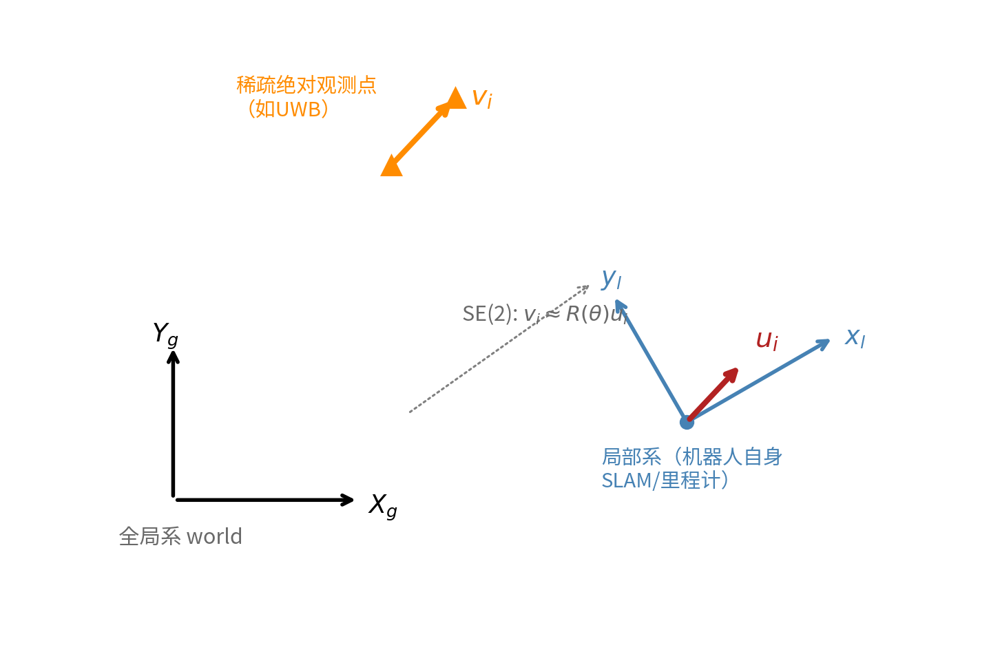
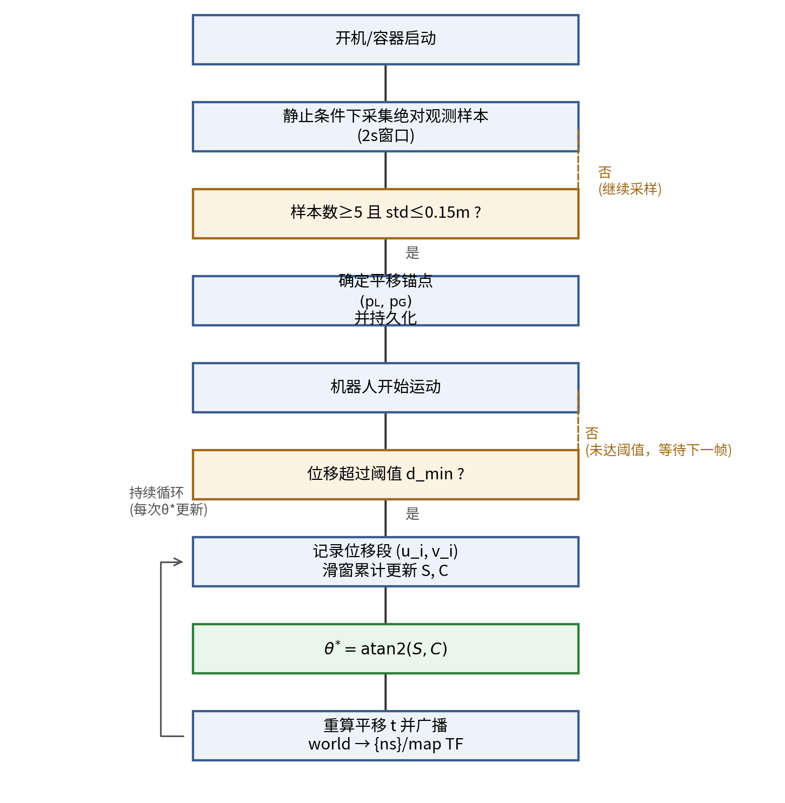
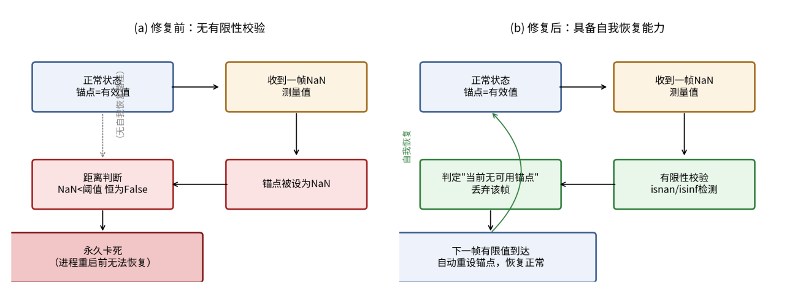
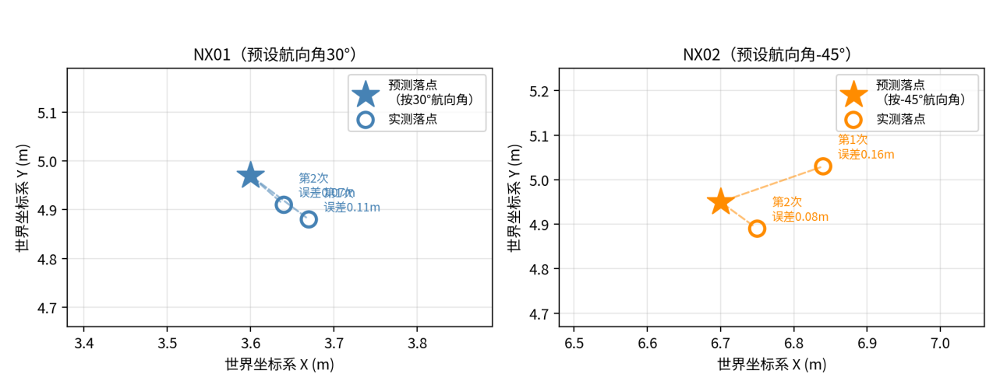
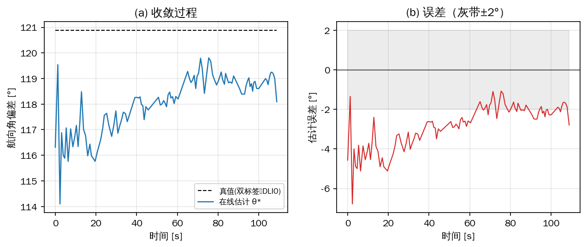

**基于滑窗最小二乘的局部-全局坐标系在线标定方法**

**摘要：**多机器人协同或单机按全局坐标执行任务，都要求把机器人局部位姿关联到全局参考系。全局定位源通常只提供三维位置、不提供姿态；机器人自身可通过任意手段获得的局部位姿则会随时间与运动距离积累漂移，因而局部-全局坐标变换无法一次性标定后固定使用，只能在线持续更新。本文研究该条件下局部-全局SE(2)刚体变换的在线求解问题，证明其为经典Horn/Umeyama轨迹对齐方法（亦即Wahba姿态确定问题）在二维仅航向角自由度下的退化情形，具有闭式解θ\*=atan2(S,C)。提出基于滑窗的在线估计机制，用运动中自然产生的位移段代替专门标定动作，推导了估计量的噪声传播模型并证明其达到Cramér-Rao下界，是渐近有效估计量；进一步给出位移段首尾相接时的方差修正式，表明运动方向一致时方差比独立噪声模型的预测小W倍，原模型是精度的保守估计。针对绝对观测中的野值，设计并验证了基于Huber损失的迭代重加权抗差方案，在10%观测被5 m野值污染时把均方根误差由30.7°压至1.7°。双机仿真闭环实验中，两机航向角偏差估计的均方根误差分别为0.74°与0.67°，全角域六个真值下误差均在0.7°以内，两机各自独立标定后经一次坐标链式复合得到的机间相对位置误差为0.029 m。机载平台（Jetson Orin NX）实测中，估计的均方根误差为2.83°，而估计量自身的重复性为0.28°~1.32°、小于所报误差，表明该精度受参考量测而非估计器限制；绝对观测的静态噪声实测0.011~0.015 m，视距下野值率与高斯理论值一致；单次更新耗时2.4~6.4 μs，相对里程计更新周期可忽略。真机同时直接观测到局部里程计航向在22分钟内漂移约9°，为本文关于必须在线持续标定这一出发点提供了实证。核心估计器独立作用于单个智能体，不依赖机器人数量与具体传感器类型。

**关键词：**坐标系标定；SE(2)刚体变换；在线估计；超宽带定位；多机器人协同；最小二乘

**Abstract:** Multi-robot coordination, and single-robot task execution specified in global coordinates, both require relating a robot's local pose to a global reference frame. Global positioning sources typically provide only three-dimensional position, not orientation, while a robot's own local pose, obtained by whatever means, accumulates drift over time and distance; consequently the local-to-global transform cannot be calibrated once and then held fixed, but must be updated online and continuously. This paper addresses online solution of the local-to-global SE(2) rigid transform under this condition, showing the problem to be the two-dimensional, yaw-only degeneracy of the classical Horn/Umeyama alignment method (equivalently, Wahba's problem), which admits the closed-form solution θ\*=atan2(S,C). A sliding-window online estimator is proposed that uses displacement segments arising naturally from motion; its noise-propagation model is derived and shown to attain the Cramér-Rao lower bound, making it asymptotically efficient. A variance correction is further derived for the end-to-end chained segmentation actually deployed, showing that for direction-consistent motion the variance is W times smaller than the independent-noise model predicts, so that the latter is a conservative bound. A Huber-loss iteratively reweighted variant is designed and validated against outliers, reducing the RMS error from 30.7° to 1.7° when 10% of observations are corrupted by 5 m outliers. In dual-UAV closed-loop simulation the yaw-offset estimates attain RMS errors of 0.74° and 0.67°, remain within 0.7° across six ground-truth angles spanning the full angular range, and the inter-agent relative position obtained by composing the two independently calibrated transforms is accurate to 0.029 m. On the onboard platform (Jetson Orin NX) the estimator attains an RMS error of 2.83 deg, while its within-run repeatability of 0.28-1.32 deg is smaller than the reported error, indicating the figure is limited by the reference measurement rather than by the estimator; the static noise of the absolute observations measures 0.011-0.015 m with a line-of-sight outlier rate matching the Gaussian expectation; each update costs 2.4-6.4 microseconds, negligible against the odometry period. The onboard trials also directly observed a 9 deg heading drift of the local odometry over 22 minutes, giving empirical support to the premise that the transform must be calibrated online and continuously. The estimator runs independently per agent and is agnostic to robot count and sensor type.

**Keywords:** coordinate frame calibration; SE(2) rigid transformation; online estimation; ultra-wideband positioning; multi-robot coordination; least squares

## 1 引言

### 1.1 研究背景

多机器人协同或单机按全局坐标执行任务，都要求把机器人的局部位姿关联到全局参考系。全局定位源（如UWB、GPS、声学定位）通常只能提供三维位置，不提供姿态；机器人自身可以通过任意手段（SLAM、视觉或惯性里程计等，本文方法不限定具体实现）获得连续的局部六自由度位姿估计，但这类局部估计会随时间与运动距离积累误差而漂移。

求解局部到全局坐标变换的动机有二：其一是多机器人协同（编队避障、共享地图、集中调度）要求各机的局部坐标系统一到同一个全局参考系；其二是即便单机场景，只要作业目标以全局坐标给出，例如按全局位置导航或前往指定地点执行任务，也需要该变换把全局目标换算到机器人自身的局部系中执行。由于局部位姿持续漂移，一次性标定得到的变换会随时间失效，局部到全局的坐标变换因而不能标定一次后固定使用，只能在线、持续地更新。

是否能够从单次观测直接测得该变换的旋转分量，取决于每个机器人身上部署了多少个同步的绝对观测点：若为每个机器人配备多点观测------动作捕捉对刚体标记点的跟踪、双天线定向GPS、双标签UWB测向------旋转理论上可以直接测出，但除了需要额外配置多个同步观测点与已知的机上几何基线、硬件与标定成本较高之外，其测向精度还从根本上受基线长度制约，基线越短角度误差越大，对体积受限、只能采用短基线的小型机器人尤其不利，量化分析见第4.6节。更常见、部署门槛更低的方案是每个机器人只携带单一位置观测点：单标签UWB测距、单天线GPS、声学定位信标、单个视觉信标检测等，这类方案只能提供全局位置。本文研究的问题是：全局观测只提供三维位置、局部位姿持续漂移因而只能在线标定的条件下，如何求解局部坐标系到全局坐标系的SE(2)变换。这一约束组合与动作捕捉、多点观测直接定向、点云配准等已有方法的适用条件均不同。

本文方法的核心估计器不依赖多机器人这一设定。方法的输入仅为单个智能体自身的局部位姿（取其位置分量）与其接收到的全局位置观测，计算独立地在该智能体上完成，与是否存在其他机器人无关------单机按全局坐标执行任务时同样需要这一变换。多机器人场景中，本文方法只是对每个智能体分别独立调用；若还需要机间相对位姿，只需两台机器人各自独立标定出世界系到自身地图系的变换后，通过共享的世界系做一次坐标链式复合即可得到，这一步复杂度可忽略。因此本文方法同样适用于单智能体场景，多机器人协同飞行仅是本文的验证载体。

可直接迁移本文方法的场景，其共同特征是全局观测仅提供位置、局部位姿存在漂移：仓储物流机器人集群（单标签UWB基站测距配合惯性/轮式里程计，本文的验证场景）、搜救应急编队、地下与隧道机器人、工地多机协同；水下机器人（DVL计程仪加IMU的局部航位推算，母船USBL声学定位提供的多数为单点位置，不含姿态）；无RTK双天线定向硬件的地面或农业机器人（单天线GPS/GNSS只提供位置轨迹）；室内行人导航（脚绑IMU航位推算配合WiFi/UWB信标）。若将问题从SE(2)扩展为完整SE(3)，本文思路还可延伸到多相机外参在线标定、航天器编队等场景，但会失去闭式解的简洁性（见第2.8节）。

### 1.2 相关工作

现有UWB与里程计融合的多机器人定位研究，绝大多数解决的是机间相对定位问题：机器人携带UWB标签直接测量彼此距离或方位，估计的是机器人间的相对位姿，不涉及统一到外部全局参考系。Nagavalli等\[1\]提出通过机间相对位置测量对齐坐标系朝向的算法；邓忠元等\[2\]及其配套专利\[3\]提出基于单UWB融合里程计的多机器人相对定位方法，滑动窗口构建非线性最小二乘，在6 m×12 m环境下取得0.32 m的相对位置精度和4.16°的相对角度精度；刘冉等\[4\]提出的多UWB节点阵列方法采用类似框架；Shin等\[5\]给出机间相对位姿估计的可观测性分析。这些工作的观测量均为机器人间的相对测量，与本文每个机器人独立对齐到共享外部绝对参考系的问题结构不同，本文称前者为机间相对定位，后者为局部-全局坐标系对齐。

与本文最相关的近期工作是Coordinate-Consistent Localization\[6\]，同样面向低成本UWB加SLAM的硬件约束，但解决的是单个机器人跨多次运行之间的坐标一致性问题，采用批量连续时间优化、依赖多个固定锚点；本文解决的是各智能体独立对齐到共享全局参考系的在线标定问题（多机器人仅为验证场景），采用递归闭式解、仅需单一绝对位置源。Autocalibration of a Mobile UWB Localization System\[7\]标定的是UWB锚点系统自身的位置，属于基础设施自标定，与机器人坐标系对齐是不同问题。

本文数学基础是Horn\[8\]的绝对定向法与Umeyama\[9\]方法：给定两组配对的点或位移向量，最小二乘求解使其近似重合的刚体变换，是SLAM社区评测工具对齐估计轨迹与真值轨迹的标准算法。本文与该方法的区别不在于最小二乘刚体对齐本身，而在于配对关系需要在线、增量地从两路异步数据流中构造出来，这一前置问题在Horn/Umeyama方法中被假定为已给定。该问题在二维、仅航向角自由度下退化到与Wahba姿态确定问题\[10\]相同的闭式解形式。点云配准方法（ICP及变体）依赖点云重叠区域且计算成本较高，传统UWB多基站三边定位需要预先测量固定锚点，二者均不适用于本文的约束条件。

### 1.3 本文贡献

本文提出局部-全局坐标系SE(2)在线标定方法，给出闭式解、滑窗估计机制、噪声传播模型及其与Cramér-Rao下界的对照，并给出首尾相接分段结构下的方差修正；设计并验证应对UWB多径观测野值的抗差扩展；报告并修复两类在线估计系统的工程缺陷，其中一类经"定量预测排除竞争假说—修复—验证"的完整闭环；在数值实验、双机仿真闭环与Jetson机载平台三个层次给出定量验证，机载实测同时给出估计精度、观测噪声特性与单次更新耗时。现有多机器人UWB定位文献几乎全部集中于机间相对定位问题，本文解决的局部-全局坐标系对齐问题此前未见系统处理，这是本文相对已有工作的主要区别。

## 2 方法

### 2.1 单智能体估计器

本文方法的核心估计器作用于单个智能体，输入为两类观测流：局部相对运动估计（可以是激光惯性里程计、轮式里程计或视觉里程计，本文以DLIO为验证实例）给出的连续位移，以及稀疏绝对位置观测（本文以UWB为验证实例）给出的间歇性全局位置。由于待估计的是SE(2)平面变换，两路观测均取其水平位置分量参与计算，高度分量不参与估计。设局部系下连续两次采样间的位移向量为$u_{i} = \left( u_{ix},u_{iy} \right)$，对应时间窗口内绝对观测的位移向量为$v_{i} = \left( v_{ix},v_{iy} \right)$，理想无噪声情形下二者满足：

$v_{i} = R(\theta)\, u_{i}$ (1)

其中$R(\theta)$为局部系到全局系航向角偏差对应的二维旋转矩阵：

$R(\theta) = \begin{pmatrix}
\cos\theta & - sin\theta \\
\sin\theta & \cos\theta
\end{pmatrix}$ (2)

式(1)(2)不含任何与机器人数量相关的量。多机器人部署时，每个智能体独立求解各自的$\theta$。

### 2.2 最小二乘代价函数与闭式解

给定滑动窗口内$W$段观测$\{\left( u_{i},v_{i} \right)\}_{i = 1}^{W}$，构造最小二乘代价函数：

$J(\theta) = \sum_{i = 1}^{W}\left. \parallel v_{i} - R(\theta)u_{i} \right.\parallel^{2}$ (3)

展开后为：

$J(\theta) = \sum_{i}^{}\left\lbrack \left( v_{ix} - u_{ix}\cos\theta + u_{iy}\sin\theta \right)^{2} + \left( v_{iy} - u_{ix}\sin\theta - u_{iy}\cos\theta \right)^{2} \right\rbrack$ (4)

对$\theta$求导并令其为零，二次项相互抵消，得：

$\sin\theta\sum_{i}^{}\left( u_{ix}v_{ix} + u_{iy}v_{iy} \right) = cos\theta\sum_{i}^{}\left( u_{ix}v_{iy} - u_{iy}v_{ix} \right)$ (5)

记：

$C \triangleq \sum_{i}^{}\left( u_{ix}v_{ix} + u_{iy}v_{iy} \right),\quad\quad S \triangleq \sum_{i}^{}\left( u_{ix}v_{iy} - u_{iy}v_{ix} \right)$ (6)

$C$为各段位移的点积和，$S$为叉积和，由式(5)(6)得闭式解：

$\theta^{\ast} = atan2(S,\, C)$ (7)

每段位移的隐式权重正比于$\left| u_{i} \right| \cdot \left| v_{i} \right|$，长距离、信噪比好的位移段自动获得更大权重。将复数形式$v_{i} = e^{j\theta}u_{i}$代入标准Wahba问题闭式解可得到相同结果，与上述推导相互印证。

### 2.3 平移锚点与SE(2)整体重构

静止条件下可获得局部里程计位置与绝对观测位置的一组样本均值，记为平移锚点$\left( p_{L},p_{G} \right)$，下标L、G分别标记局部系与全局系下的位置均值。每次$\theta^{\ast}$更新后，复用同一对锚点重新计算平移：

$t = p_{G} - R\left( \theta^{\ast} \right) \cdot p_{L}$ (8)

得到自洽的SE(2)变换$\left( R\left( \theta^{\ast} \right),t \right)$。下游任意局部坐标点$\left( l_{x},l_{y} \right)$到全局坐标$\left( w_{x},w_{y} \right)$的正向变换为：

$w_{x} = t_{x} + l_{x}\cos\theta^{\ast} - l_{y}\sin\theta^{\ast},\quad\quad w_{y} = t_{y} + l_{x}\sin\theta^{\ast} + l_{y}\cos\theta^{\ast}$ (9)

问题场景与$u_{i}$、$v_{i}$的几何关系如图1所示。

{width="5.833333333333333in" height="3.8808530183727035in"}

图1 局部相对运动与稀疏绝对观测的抽象问题结构

### 2.4 对恒定全局偏置的鲁棒性

第2.2、2.3节的推导假设绝对观测只含零均值噪声，但实际部署中绝对定位技术可能引入一个持续存在的系统性偏置（如信号传播路径异常导致的固定偏移）。设某次绝对观测的原始读数为${\widetilde{p}}_{k} = p_{k} + b$，其中$p_{k}$为真实全局位置，$b$为固定不变的偏置向量。由于本文方法仅使用相邻两次绝对观测之差构造$v_{i}$，偏置在差分时精确抵消：

$v_{i} = {\widetilde{p}}_{k_{i}} - {\widetilde{p}}_{k_{i} - 1} = \left( p_{k_{i}} + b \right) - \left( p_{k_{i} - 1} + b \right) = p_{k_{i}} - p_{k_{i} - 1}$ (10)

即$v_{i}$与$b$无关。由式(6)(7)，旋转估计$\theta^{\ast}$对任意恒定偏置$b$精确无偏，这是差分式估计器结构本身决定的性质，不依赖$b$的大小或方向，不需要额外处理。

平移分量不具备同样的免疫性：静止标定阶段的平移锚点$p_{G}$直接取自绝对观测的样本均值，会原样继承偏置，代入式(8)得：

$t = t_{true} + b$ (11)

即整个局部-全局映射在全局系下产生一个恒定的$b$方向平移，机器人自身局部系内部的一致性不受影响。若多台机器人共享同一个偏置来源，各机的平移误差相同，机间相对位姿不受影响，只有当需要匹配外部真值（如地图或第三方系统给出的绝对坐标）时，这一固定偏移才会造成实际误差。式(10)(11)成立的前提是偏置$b$在标定窗口内保持恒定；若偏置随时间或位置变化，上述免疫性不再成立，见第6.2节讨论。

### 2.5 分段策略与滑窗更新

设最小位移阈值$d_{\min} = 0.5\, m$，智能体每移动超过该阈值才记录一个新的位移段，避免短距离段被噪声主导。滑动窗口维护最近$W = 50$段位移对，式(6)中$C$、$S$在滑窗内滚动求和，新段加入、最老段移出，使方法能够跟踪局部-全局映射关系的缓慢时变，区别于用全部历史数据一次性求解的批量方法（对比见第4.2.3节）。方法完整流程如图2所示。

{width="5.833333333333333in" height="5.969926727909011in"}

图2 SE(2)在线标定方法流程图

智能体通电静止后，主动触发一次静止条件标定：取最近2 s窗口内的绝对位置观测样本，数量不少于5个且标准差不超过0.15 m方认为可信，与局部里程计位置求均值差得到平移锚点，标定结果持久化，进程或容器重启后自动恢复。表1汇总本文方法涉及的符号与参数取值。

**表1 符号说明与参数取值**

  ----------------------------------------------------------------------------------------------------------------
  **符号/参数**        **含义**                     **取值**       **依据**
  -------------------- ---------------------------- -------------- -----------------------------------------------
  $$u_{i},\, v_{i}$$   第$i$段局部/全局位移向量     ---            式(1)

  $$\theta^{\ast}$$    航向角偏差估计               在线更新       式(7)

  $$C,\, S$$           滑窗累积点积和/叉积和        在线更新       式(6)

  $$d_{\min}$$         最小分段位移阈值             0.5 m          式(12)：单段角度噪声约8.1°

  $$W$$                滑动窗口大小                 50段           式(13)：收敛后标准差约1.15°

  静止采样窗口         平移锚点标定采样时长         2 s            ---

  可信样本数阈值       平移锚点标定最少样本数       5              ---

  可信标准差阈值       平移锚点标定样本离散度上限   0.15 m         约3倍单次测距噪声标准差

  $$\sigma$$           绝对位置观测噪声标准差       仿真取0.05 m   保守取值；真机实测0.0105~0.0151 m，见第4.6.2节

  双标签基线长度       真机UWB双标签测向基线        安装0.28 m     解算实测间距0.465 m，见第4.6.3、4.6.6节

  双标签容差           基线长度校验容差             0.15 m         $\sqrt{2}\sigma \approx 0.07\, m$的一倍多裕量
  ----------------------------------------------------------------------------------------------------------------

### 2.6 噪声传播分析与统计效率

设绝对观测噪声为各向同性高斯噪声，标准差$\sigma$。$v_{i}$为相邻两次绝对观测之差，噪声方差为$2\sigma^{2}$。设第$i$段真实位移长度$d_{i} = \left| u_{i} \right|$，仅噪声的垂直分量在一阶近似下引起角度误差，该分量方差同样为$2\sigma^{2}$，故第$i$段贡献的角度噪声方差为：

$Var\left( \varphi_{i} \right) \approx \frac{2\sigma^{2}}{d_{i}^{2}}$ (12)

以$d_{\min} = 0.5\, m$、$\sigma = 0.05\, m$代入，单段角度噪声标准差约为$8.1{^\circ}$，与实测量级一致。对滑窗内$W$段独立噪声做一阶传播，得估计量方差：

$Var\left( \widehat{\theta} \right) \approx \frac{2\sigma^{2}}{\sum_{i}^{}d_{i}^{2}}$ (13)

以$W = 50$段、$d_{i} \approx 0.5\, m$代入，$Var\left( \widehat{\theta} \right) \approx 4 \times 10^{- 4}\,{rad}^{2}$，标准差约$1.15{^\circ}$。该预测在4.2.1节的数值实验中得到确认（实测$1.133{^\circ}$）；仿真闭环的实测精度见4.3.1节，两机的均方根误差分别为$0.74{^\circ}$与$0.67{^\circ}$，优于该值，原因见下文式(17)(18)。

将式(3)解释为高斯噪声下的极大似然估计，可求得关于$\theta$的Fisher信息。旋转矩阵对$\theta$的导数是保范数变换，故：

$I(\theta) = \frac{1}{2\sigma^{2}}\sum_{i}^{}\left. \parallel\frac{\partial R(\theta)}{\partial\theta}u_{i} \right.\parallel^{2} = \frac{1}{2\sigma^{2}}\sum_{i}^{}d_{i}^{2}$ (14)

由Cramér-Rao不等式\[11\]，任意无偏估计量的方差满足：

$Var\left( \widehat{\theta} \right)\  \geq \ \frac{1}{I(\theta)} = \frac{2\sigma^{2}}{\sum_{i}^{}d_{i}^{2}}$ (15)

对照式(13)，本文闭式解的方差在同一噪声模型与一阶近似下达到该下界，即$\theta^{\ast} = atan2(S,C)$在高斯噪声模型下是渐近有效估计量。

上述推导假设各段全局位移观测的噪声相互独立。但2.5节的分段策略是首尾相接的——每段的终点即下一段的起点——相邻两段因而共享同一次绝对观测，噪声并不独立。设绝对观测序列为$p_{0},\ldots,p_{W}$，各含独立噪声$n_{k}$，则$v_{i} = \left( p_{i} + n_{i} \right) - \left( p_{i - 1} + n_{i - 1} \right)$。代入式(6)中$S$的定义并做Abel求和，噪声项为：

$S_{noise} = \sum_{i = 1}^{W}u_{i} \times \left( n_{i} - n_{i - 1} \right) = \sum_{i = 1}^{W - 1}\left( u_{i} - u_{i + 1} \right) \times n_{i} + u_{W} \times n_{W} - u_{1} \times n_{0}$ (16)

在$C \approx \sum_{i}^{}d_{i}^{2}$的一阶近似下，得到计入端点共享后的估计方差：

$Var\left( \widehat{\theta} \right) \approx \frac{\sigma^{2}\left\lbrack \sum_{i = 1}^{W - 1}\left. \parallel u_{i} - u_{i + 1} \right.\parallel^{2} + \left. \parallel u_{1} \right.\parallel^{2} + \left. \parallel u_{W} \right.\parallel^{2} \right\rbrack}{\left( \sum_{i}^{}d_{i}^{2} \right)^{2}}$ (17)

式(17)有两个有意义的极限。位移方向随机时$\mathbb{E}\left. \parallel u_{i} - u_{i + 1} \right.\parallel^{2} = 2d^{2}$，代入后化简即回到式(13)，说明式(13)在方向多样的运动下依然准确。位移方向一致（沿直线运动）时$u_{i} - u_{i + 1} = 0$，求和项整体消失，只剩两个端点项：

$Var\left( \widehat{\theta} \right) \approx \frac{2\sigma^{2}}{\left( \sum_{i}^{}d_{i} \right)^{2}}$ (18)

即方差由"单段位移的平方和"改由"总位移的平方"决定，比式(13)小$W$倍、标准差小$\sqrt{W}$倍——窗口内部各次观测的噪声两两抵消，只有首尾两次观测的噪声进入结果，估计的等效基线是整条轨迹的总位移而非单段位移。这一结果不与式(15)矛盾：式(15)是在"各段噪声相互独立"这一模型下导出的下界，而首尾相接的实际观测模型中噪声相关，对应的Fisher信息本就更大、下界更低。换言之，式(13)(15)是本文方法精度的保守估计，实际部署中若运动方向较为一致，精度会显著优于该预测；数值验证见4.2.1节。

### 2.7 抗差扩展

前述噪声传播分析假设噪声各向同性高斯，但UWB测距在室内环境中存在多径与非视距效应，导致某次绝对观测出现有限但显著偏离真实值的野值，这类错误不会被3.1节的有限性校验拦截。式(6)的加权机制在野值场景下方向有误：若某次污染使$v_{i}$的模长偏大，该段反而获得更大权重。

记第$i$段在当前估计$\widehat{\theta}$下的残差：

$r_{i} = \left. \parallel v_{i} - R\left( \widehat{\theta} \right)u_{i} \right.\parallel$ (19)

采用Huber权重函数\[12\]：

$w_{i}\left( r_{i} \right) = \left\{ \begin{matrix}
1, & r_{i} \leq k \\
k/r_{i}, & r_{i} > k
\end{matrix} \right.\ $ (20)

$k$按滑窗内近期残差的中位数绝对偏差（MAD）设定，设计取k=3×MAD，在高斯残差假设下约相当于2倍等效标准差。式(6)相应替换为加权累加：

$C_{w} = \sum_{i}^{}w_{i}\left( u_{ix}v_{ix} + u_{iy}v_{iy} \right),\quad\quad S_{w} = \sum_{i}^{}w_{i}\left( u_{ix}v_{iy} - u_{iy}v_{ix} \right)$ (21)

取$\theta^{\ast} = atan2\left( S_{w},C_{w} \right)$。正常数据下$w_{i} = 1$，退化为原始闭式解；检测到野值时降权。权重计算依赖上一时刻的估计值，构成一次迭代重加权最小二乘过程，计算成本仍为滑窗内的$O(W)$操作。该扩展的数值验证见4.2.4节、仿真闭环验证见4.3.5节，其适用边界（污染比例约20%的崩溃点）与实测计算开销分别见4.2.4节与4.3.6节。

### 2.8 向SE(3)的推广

本文方法向完整SE(3)场景的推广，数学结构上是式(1)--(15)在维度上的自然延伸，但会引入两点变化。

三维情形下待估计的旋转矩阵$R \in SO(3)$有三个自由度，将式(6)的标量累加推广为相关矩阵的滑窗累加：

$H = \sum_{i}^{}u_{i}v_{i}^{\top}$ (22)

对$H$做奇异值分解$H = U\Sigma V^{\top}$，最优旋转由Kabsch/Umeyama公式给出：

$R^{\ast} = V\, diag\left( 1,1,det\left( VU^{\top} \right) \right)\, U^{\top}$ (23)

式(22)的滑窗累加与式(6)机制一致，新段进窗口做一次外积累加，旧段出窗口做一次减法，仍为$O(1)$增量更新，第2节的在线估计框架无需改动，改变的只是读数步骤：从直接读$\theta^{\ast} = atan2(S,C)$变为对累积矩阵$H$做一次奇异值分解，本文强调的单次三角函数调用这一简洁性随之失去。平移分量处理逻辑不变，仅将式(8)的$R\left( \theta^{\ast} \right)$替换为$R^{\ast}$。

第二点变化是可观测性条件：单一三维向量对$\left( u_{i},v_{i} \right)$只能约束旋转的两个自由度，绕该方向轴自身的旋转分量不受约束。三维旋转的完整可观测性要求累积矩阵$H$的秩不低于2，即滑窗内至少包含两段方向不平行的位移，这与星敏感器定姿至少需要两颗不共线的恒星、IMU与磁力计融合定姿需要重力与磁场两个不平行的参考方向是同一经典结果。

多旋翼无人机等近似水平运动的平台横滚与俯仰角通常很小，SE(2)已足够。SE(3)扩展有意义的场景是局部体坐标系相对全局系存在持续变化倾斜角的移动平台，腿足机器人是典型代表：其机体姿态随步态周期持续摆动，若通过稀疏绝对位置源在线标定本体里程计到全局系的变换而仅估计航向角，机体相对水平面的持续倾斜未被显式建模，会从姿态解算的源头引入系统性误差，而非随时间缓慢累积。将本文方法扩展到SE(3)、接入腿足机器人的在线定位标定流程是一个具体的后续研究方向，第3节的鲁棒性工程模式在姿态波动更剧烈的平台上预期同样适用。该扩展目前仅完成数学结构分析，尚未实现与实验验证。

## 3 工程实现与案例分析

### 3.1 非有限测量值污染锚点导致永久卡死

系统联调阶段观察到如下故障：诊断话题从未发布过估计结果，滑窗分段计数长期停留在0。独立编写诊断脚本复刻同一分段判定逻辑单独订阅原始数据流，能够正常记录分段，说明算法逻辑本身无误；但生产环境中长期运行的真实节点实例依然卡在0，说明该实例内部状态被污染。根因是绝对观测源在启动瞬间可能发出一帧非有限值，若被当作分段锚点记录，之后每次位移长度计算均为非有限结果，而距离阈值比较在浮点语义下恒为假，判断条件永远无法满足；且原实现的锚点只在成功记录新段后才更新，不存在自我恢复路径。图3描述了该失效的状态转移过程。修复方式是在分段判定函数中加入有限性校验，非有限值出现时判定为无可用锚点并用下一帧有限值重新设定，赋予运行时任意时刻发生的坏数据自动恢复的能力。

{width="5.833333333333333in" height="2.171829615048119in"}

图3 NaN污染锚点问题的状态转移示意图

诊断话题最初仅在累计段数达到可信阈值后才首次发布，导致运维人员无法区分尚未收敛与已经卡死两种状态，这也是上述问题早期难以定位的原因之一。修复方式是让诊断接口无条件公开当前进度，包括累计段数、当前估计值与是否达到可信阈值，使两种状态在外部观测者眼中可区分。

### 3.2 标定持续更新与目标点读取时机的同步问题

目标点从操作界面到规划器内部目标的转换是一次性坐标变换：收到目标点消息时按式(9)查询当时的$\left( \theta^{\ast},t \right)$完成变换，结果固定发布，此后$\theta^{\ast}$的任何后续修正不会追溯应用到已发布的目标点。

一次双机对向穿越路径（下称对穿）测试中，两机最终停留位置与预期目标点存在系统性偏差，最初被归因于局部里程计累积漂移。用真实预设航向角（30°与-45°）反算若目标点变换完全不做旋转补偿会落在全局系何处：一台无人机预测落点$(3.60,4.97)$，两次独立实测为$(3.67,4.88)$与$(3.64,4.91)$，误差量级0.07--0.11 m；另一台预测落点$(6.70,4.95)$，两次独立实测为$(6.84,5.03)$与$(6.75,4.89)$，误差量级0.08--0.16 m，如图4所示。旋转补偿缺失假说对两次独立实验均给出精确、可重复的定量预测，而里程计漂移假说不具备这种预测能力，漂移量应随时间与路径累积变化，不会两次都落在同一个可由固定角度偏差解释的位置。

{width="5.833333333333333in" height="2.269374453193351in"}

图4 目标点未随航向角持续修正假说的预测落点与两次独立对穿测试实测落点对照

同一系统中，跨机坐标对齐的硬件可迁移实现采用持续周期性重新查询当前$\left( \theta^{\ast},t \right)$的设计（默认10 Hz），不受本节问题影响。据此，本节问题的修复方向是将目标点读取端改为持续跟踪目标点在全局系下的原始输入，每次$\theta^{\ast}$更新都重新变换、重新发布局部目标，直到智能体到达为止。该修复已按此方向实现，修复前后的对照实验见4.4节：落点误差由$2.028 \pm 0.390\, m$降至$0.168 \pm 0.100\, m$。

## 4 实验与验证

本章分三个层次验证第2、3节的方法与结论：4.2节用蒙特卡洛数值实验直接检验各条解析结论，4.3、4.4节在双机协同无人机容器化仿真平台上做闭环验证，4.6节在Jetson机载平台上给出真机实测；4.5节给出与现有方法的比较。

### 4.1 实验设置

数值实验按第2节的观测模型合成数据：给定真值航向角偏差$\theta_{0}$，按式(1)生成局部位移段$u_{i}$，经$R(\theta_{0})$旋转后叠加观测噪声得到$v_{i}$，再送入与机载实现完全相同的分段、滑窗累加与式(7)读数流程。除非另行说明，参数取表1的标称值：$\sigma = 0.05\, m$、$d_{\min} = 0.5\, m$、$W = 50$、$\theta_{0} = 30{^\circ}$，每个配置重复2000次独立试验（含时序过程的实验分别取30至1000次）。

仿真实验在双机协同无人机容器化仿真平台上进行。平台以Gazebo Classic提供世界真值与传感器仿真，PX4 SITL提供飞控闭环，局部位姿由激光惯性里程计DLIO提供，绝对位置观测由仿真节点在世界真值上叠加零均值高斯噪声产生（$\sigma = 0.05\, m$），两机预设航向角默认分别为$30{^\circ}$与$-45{^\circ}$，出生点相距3 m。每次实验的流程为：静止状态下触发一次平移锚点标定，起飞至1 m悬停，随后在各自局部坐标系内沿边长3 m的正方形航线飞行3圈（累计路径36 m，足以填满$W = 50$的滑窗），全程录制原始数据流离线复算。评估真值取自仿真世界状态，逐时刻计算$\theta_{true}(t) = \psi_{world}(t) - \psi_{odom}(t)$，即把局部里程计自身的航向漂移也计入评估基准，而不是固定采用出生时的预设角度。

离线复算工具复刻机载节点的分段与滑窗逻辑，其可信性由两条独立证据支撑：一是在含10%野值的同一组输入上，机载实现与离线副本给出的$\theta^{\ast}$差异小于$10^{-12}\, rad$；二是离线复算在实测数据上重建出的$\theta^{\ast}$末值与机载节点当时实际发布的诊断值逐位一致（如第4.3.1节首次实验的$30.273{^\circ}$与$-44.544{^\circ}$）。

关于仿真平台，有三点会影响结论解读，需要明确说明。其一，仿真中"更新率"配置值不等于真实发布频率，需乘以仿真实时因子，该因子在双机高负载场景下实测在0.27–0.53之间波动，因此本文涉及"多长时间收敛"的结论同时给出"收敛时已累积多少段位移"这一与平台速率无关的度量。其二，本平台绝对位置观测的发布路径直接挂在世界状态回调上，实际发布率等于世界状态插件的更新率（100 Hz仿真时间）且不经过时延队列，比真实超宽带模块（典型10–50 Hz、数十毫秒时延）乐观，因此仿真闭环给出的精度应视为观测条件充分时的结果。其三，本平台中两路观测甚至不共享同一时钟域：局部里程计运行在仿真时钟上，绝对观测节点使用宿主机墙钟，二者的时间戳既有固定偏移又有走时速率差异，这一点对4.2.7节的讨论有直接影响。

最后需要指出一条实验设计原则。早期验证曾在两机预设航向角均为零的默认场景下进行，该场景下真值$\theta$本身为零，即使算法实现存在符号错误或系数错误，测试结果也可能看似正常。验证旋转对齐类算法必须预先建立非零真值场景，本文全部实验据此统一采用非零真值配置，并在4.3.2节进一步做了全角域扫描。

### 4.2 数值验证

#### 4.2.1 噪声传播模型与统计效率

在各段观测噪声相互独立、位移方向随机的条件下，实测估计标准差与式(13)的理论预测在$W$跨两个数量级的范围内一致，比值稳定在0.97–1.02之间（表2上半部分）。2.6节给出的两个具体数值预测得到确认：单段情形理论$8.10{^\circ}$、实测$8.28{^\circ}$；$W = 50$时理论$1.146{^\circ}$、实测$1.133{^\circ}$。由于式(13)与式(15)的Cramér-Rao下界在同一噪声模型下数值相同，该结果同时确认了本文闭式解在该模型下是渐近有效估计量这一论断。式(13)预言的两条标度关系也成立：固定$W = 50$、$d = 0.5\, m$，$\sigma$取0.02/0.05/0.10 m时实测标准差为$0.451{^\circ}$/$1.133{^\circ}$/$2.365{^\circ}$（理论$0.458{^\circ}$/$1.146{^\circ}$/$2.292{^\circ}$）；固定$\sigma = 0.05\, m$，$d$取0.3/0.5/1.0/2.0 m时实测为$1.929{^\circ}$/$1.133{^\circ}$/$0.573{^\circ}$/$0.280{^\circ}$（理论$1.910{^\circ}$/$1.146{^\circ}$/$0.573{^\circ}$/$0.286{^\circ}$）。

表2下半部分验证2.6节关于位移段首尾相接的结论。方向随机时实测标准差$1.151{^\circ}$与式(13)的$1.146{^\circ}$一致，说明式(17)在方向多样的运动下确实退化为式(13)；方向一致时实测$0.162{^\circ}$，与式(18)预测的$0.162{^\circ}$吻合，而式(13)预测$1.146{^\circ}$，二者相差7.1倍，与$\sqrt{W} = \sqrt{50} = 7.07$一致。这确认了式(13)(15)是本文方法精度的保守估计：实际部署中若运动方向较为一致，精度会显著优于该预测。

**表2 噪声传播模型的数值验证（每组2000次重复）**

| 条件 | $W$ | 实测标准差 [°] | 式(13) [°] | 式(17)/(18) [°] |
|---|---|---|---|---|
| 各段噪声独立、方向随机 | 1 | 8.276 | 8.103 | — |
| 各段噪声独立、方向随机 | 2 | 5.828 | 5.730 | — |
| 各段噪声独立、方向随机 | 5 | 3.596 | 3.624 | — |
| 各段噪声独立、方向随机 | 10 | 2.551 | 2.562 | — |
| 各段噪声独立、方向随机 | 20 | 1.754 | 1.812 | — |
| 各段噪声独立、方向随机 | 50 | 1.133 | 1.146 | — |
| 各段噪声独立、方向随机 | 100 | 0.793 | 0.810 | — |
| 首尾相接、方向随机 | 50 | 1.151 | 1.146 | 1.146 |
| 首尾相接、方向一致 | 50 | 0.162 | 1.146 | 0.162 |

注：$\sigma = 0.05\, m$、$d = 0.5\, m$。首尾相接是机载实现的真实结构。

图5 噪声传播与统计效率验证。(a) 独立噪声模型下实测标准差与式(13)/CRLB理论曲线（灰线）的对照；(b) 分段长度$d$的影响；(c) 位移段首尾相接引起的噪声相消，机载实现对应后两条曲线

#### 4.2.2 恒定全局偏置免疫性

按2.4节的模型在绝对观测上叠加恒定偏置$b$，取$\lVert b \rVert \in \{0,\ 0.5,\ 2.0\}\, m$、方向分别为$0{^\circ}$/$90{^\circ}$/$217{^\circ}$共9组配置。全部配置下旋转估计$\theta^{\ast}$相对无偏置基准的偏差均为数值零（浮点意义下的精确抵消），验证了式(10)所述的结构性免疫；平移分量的误差恒等于$\lVert b \rVert$本身，验证了式(11)。该性质由差分式估计器的结构决定，与偏置的大小和方向无关。闭环验证见4.3.5节。

#### 4.2.3 与批量最小二乘的比较

批量方法用全部历史位移段一次性求解，样本量随时间单调增长，在映射关系恒定时稳态精度不劣于滑窗方法；本文采用滑窗的理由是局部-全局映射会随局部里程计的缓慢漂移而时变。令真值按$\theta_{true}(t) = \theta_{0} + \omega t$线性漂移，飞行速度$1\, m/s$（每段耗时$\Delta t = 0.5\, s$），总时长600 s，对比滑窗（$W = 50$）与批量方法。

滑窗方法的稳态误差有解析预期：窗口内数据的平均"年龄"为$(W - 1)\Delta t/2$，故稳态滞后$\mathbb{E}[\widehat{\theta} - \theta_{true}] \approx - \omega (W-1)\Delta t/2$，与时间无关、有界；批量方法的窗口是全历史，平均年龄为$t/2$，滞后随时间线性发散。表3的结果与该预期一致，图6给出误差时间曲线，批量方法的误差曲线是一条持续下降的直线，不存在稳态。

即便在$\omega = 0.01{^\circ}/s$（每分钟$0.6{^\circ}$）这一相当缓慢的漂移率下，批量方法在10分钟飞行内的误差也已累积到$-2.55{^\circ}$、超过噪声水平，而滑窗方法的误差仍被噪声主导。这说明滑窗结构的必要性不取决于漂移是否剧烈，而取决于任务时长：只要映射关系存在任何非零漂移，批量方法的误差最终都会超过滑窗方法，超出时刻随漂移率减小而推迟、但不会消失。作为对照，在4.3.3节的实测数据上（36 m、约60 s的飞行，映射漂移不显著），批量与滑窗给出相同的均方根误差$0.90{^\circ}$——这正是上述分析预期的结果，二者的差异只在长时间任务中显现。

**表3 批量方法与滑窗方法在时变映射下的误差（$W = 50$，飞行600 s，30次重复，取后30%时段统计）**

| 映射漂移率 $\omega$ [°/s] | 滑窗稳态误差 [°] | 解析预期 [°] | 滑窗RMSE [°] | 批量稳态误差 [°] | 批量RMSE [°] |
|---|---|---|---|---|---|
| 0.01 | −0.19 | −0.12 | 1.19 | −2.55 | 2.58 |
| 0.10 | −1.16 | −1.23 | 1.62 | −25.41 | 25.55 |
| 0.50 | −6.16 | −6.12 | 6.27 | −127.44 | 128.11 |

图6 批量方法与滑窗方法对时变局部-全局映射的跟踪能力

#### 4.2.4 抗差扩展

按2.7节的模型，以概率$p$对绝对观测叠加幅度为$m$、方向随机的野值。由于位移段首尾相接，一次被污染的观测会同时影响相邻两段，与真实系统中的传播方式一致。对比原始闭式解式(7)与Huber重加权式(21)（$k = 3 \times MAD$，3次迭代），结果见表4与图7。

无野值时抗差扩展的效率代价很小：均方根误差由$1.18{^\circ}$增至$1.22{^\circ}$，相对损失约3%，与Huber估计量在高斯情形下的理论效率损失量级相符。存在野值时改善显著：10%的观测被5 m野值污染时，原始解的均方根误差达$30.66{^\circ}$，抗差解为$1.74{^\circ}$，改善约17倍，95%分位误差由$62.36{^\circ}$降至$3.46{^\circ}$。野值幅度越大改善越明显，这与2.7节的分析一致：式(6)的隐式权重正比于$\lVert u_{i} \rVert \cdot \lVert v_{i} \rVert$，被污染段的$\lVert v_{i} \rVert$更大、反而获得更大权重，野值幅度越大这一错误加权越严重，而Huber权重恰好抵消这一机制。

抗差扩展存在崩溃点：污染比例达到20%时，$MAD$尺度估计本身已被野值抬高，均方根误差回升至$6.30{^\circ}$（2 m野值）与$18.02{^\circ}$（5 m野值），不再能保证可用精度。这一边界与Huber型M估计的已知性质一致，实用中应把20%视为该方案的适用上限，超出时需改用高崩溃点估计量或在观测端先做门限剔除。闭环验证见4.3.5节。

**表4 抗差扩展在野值污染下的估计误差（$W = 50$，400次重复）**

| 野值幅度 [m] | 野值比例 | 原始式(7) RMSE [°] | Huber式(21) RMSE [°] | 原始 p95 [°] | Huber p95 [°] |
|---|---|---|---|---|---|
| — | 0% | 1.18 | 1.22 | 2.40 | 2.55 |
| 0.5 | 10% | 2.89 | 1.63 | 5.70 | 3.05 |
| 2.0 | 5% | 7.74 | 1.32 | 15.23 | 2.67 |
| 2.0 | 10% | 9.76 | 1.62 | 18.80 | 3.00 |
| 5.0 | 2% | 11.67 | 1.26 | 27.28 | 2.55 |
| 5.0 | 5% | 25.94 | 1.35 | 44.68 | 2.67 |
| 5.0 | 10% | 30.66 | 1.74 | 62.36 | 3.46 |
| 5.0 | 20% | 47.73 | 18.02 | 95.08 | 12.70 |

图7 抗差扩展在不同野值比例与幅度下的效果（$W = 50$）

#### 4.2.5 运动方向与可观测性

第5节提出两条论断：纯噪声情形下估计方差只取决于$\sum_i d_i^2$、与方向多样性无关；但若局部里程计存在方向相关的系统性偏置，单一方向的位移段无法把该偏置与真实旋转角区分开。本节对两条论断分别给出定量验证。方向相关偏置用剪切矩阵$A = \begin{pmatrix} 1 & \gamma \\ 0 & 1 \end{pmatrix}$建模，里程计读数为$u_{i}^{meas} = A u_{i}$：沿局部$x$轴运动时不受影响，沿局部$y$轴运动时被扭转$\arctan\gamma$，即"偏置引起的等效角度"本身依赖运动方向。判据取两条：$\theta^{\ast}$的系统偏差（偏置被误当作旋转角吸收的部分），以及残差均方根相对纯噪声水平$2\sigma$的抬升（模型失配能否被观测到）。

结果见表5与图8。$\gamma = 0$时单方向与多方向的估计标准差分别为$1.13{^\circ}$与$1.17{^\circ}$，在统计误差内相同，第一条论断成立。存在偏置时，单方向运动下$\theta^{\ast}$的系统偏差恰好等于$\arctan\gamma$（$\gamma = 0.20$时实测$+11.29{^\circ}$，$\arctan\gamma = 11.31{^\circ}$），且残差始终停在噪声水平（比值0.99–1.00）——偏置被完全吸收进$\theta$，从数据内部无法察觉其存在。多方向运动下同一偏置只造成约一半的系统偏差（$+5.71{^\circ}$），且残差抬升到噪声水平的1.11倍，模型失配开始在残差中显现。这一对照定量说明：方向多样性的作用不是降低噪声引起的方差，而是把"里程计系统性偏置"与"真实旋转角"这两个原本混淆的量分开，并使前者变得可检测；工程上可据此把残差均方根相对$2\sigma$的比值作为在线自检指标。

**表5 运动方向多样性与里程计方向相关偏置的交互（$W = 50$，$\sigma = 0.05\, m$，1000次重复）**

| 方向模式 | $\gamma$ | $\theta^{\ast}$系统偏差 [°] | $\arctan\gamma$ [°] | 标准差 [°] | 残差RMS/噪声水平 |
|---|---|---|---|---|---|
| 单方向 | 0 | +0.02 | 0 | 1.13 | 0.99 |
| 单方向 | 0.05 | +2.90 | 2.86 | 1.12 | 0.99 |
| 单方向 | 0.10 | +5.67 | 5.71 | 1.13 | 1.00 |
| 单方向 | 0.20 | +11.29 | 11.31 | 1.17 | 1.00 |
| 多方向 | 0 | −0.00 | 0 | 1.17 | 0.99 |
| 多方向 | 0.05 | +1.40 | 2.86 | 1.18 | 1.00 |
| 多方向 | 0.10 | +2.89 | 5.71 | 1.19 | 1.02 |
| 多方向 | 0.20 | +5.71 | 11.31 | 1.34 | 1.11 |

图8 运动方向多样性与可观测性。(a) 里程计方向相关偏置被误当作旋转角吸收的程度；(b) 模型失配在残差中的可检测性

#### 4.2.6 观测异步的影响

本文的估计器在构造$v_{i}$时取局部里程计更新时刻"最近一帧"绝对观测，未做时间戳对齐。绝对定位源的发布率有限且存在处理时延，端点数据的陈旧程度因而在一个发布周期内随机抖动，这一项未包含在式(12)(13)的噪声模型中。以10 Hz发布率、30 ms固定时延为设置，对比三种取数方式：理想时间对齐、最近一帧（本文实现）与时间戳线性插值，轨迹分匀速直线与持续转弯两类，速度取0.3/1.0/2.0 m/s，结果见表6与图9。

最近一帧与理想对齐的均方根误差几乎相同（$0.156$–$0.161{^\circ}$对$0.151$–$0.176{^\circ}$），仅在持续转弯且速度1 m/s时出现$-0.092{^\circ}$的系统偏差。原因可由式(16)(17)解释：观测陈旧表现为绝对观测的位置域误差，与测量噪声一样出现在共享端点上，因而在首尾相接的差分结构中被同样地抵消，只有轨迹曲率破坏这一抵消时才留下残差。相反，时间戳线性插值反而使误差增大到$0.25$–$0.37{^\circ}$：插值混合了两帧观测的独立噪声，并破坏了相邻段共享端点这一相消结构。实测数据上的结论相同：同一段飞行数据用两种配对方式离线复算，均方根误差分别为$0.90{^\circ}$与$0.91{^\circ}$。据此本文保留"最近一帧"的实现。

需要补充的是，在本文的仿真平台上时间戳对齐甚至不具备可行性——局部里程计与绝对观测节点运行在不同的时钟域，二者的时间戳既有固定偏移又有走时速率差异（见4.1节）。这一点强化了上述结论：按到达顺序配对不仅在精度上没有损失，而且是这类异构系统中更稳健的工程选择。

**表6 观测异步对估计精度的影响（10 Hz发布率、30 ms时延，300次重复，均方根误差[°]）**

| 轨迹 | 速度 [m/s] | 理想时间对齐 | 最近一帧（本文） | 时间戳插值 |
|---|---|---|---|---|
| 匀速直线 | 0.3 | 0.151 | 0.158 | 0.252 |
| 匀速直线 | 1.0 | 0.168 | 0.161 | 0.367 |
| 匀速直线 | 2.0 | 0.158 | 0.160 | 0.288 |
| 持续转弯 | 0.3 | 0.152 | 0.156 | 0.254 |
| 持续转弯 | 1.0 | 0.177 | 0.196 | 0.328 |
| 持续转弯 | 2.0 | 0.154 | 0.156 | 0.274 |

图9 观测异步对估计精度的影响（绝对观测10 Hz、时延30 ms）

### 4.3 仿真闭环验证

#### 4.3.1 收敛精度

两机在$30{^\circ}$与$-45{^\circ}$的预设航向角下重复5次完整实验，每次实验的$\theta^{\ast}$误差统计取收敛后（末尾30%时段）计算，结果见表7。两机的均方根误差分别为$0.74 \pm 0.13{^\circ}$与$0.67 \pm 0.20{^\circ}$，稳态偏差分别为$-0.34 \pm 0.35{^\circ}$与$+0.24 \pm 0.37{^\circ}$，末次估计与真值的偏差在$-0.67{^\circ}$至$+0.58{^\circ}$之间。该精度与4.2.1节的理论预测一致：实测运动包含直线段与转角，介于"方向一致"（式(21)，$0.16{^\circ}$）与"方向随机"（式(13)，$1.15{^\circ}$）两个极端之间。图10给出两机的$\theta^{\ast}(t)$与逐时刻真值对照及误差曲线。

收敛速度以"误差首次进入且此后保持在$\pm 2{^\circ}$内所需的位移段数"度量，两机分别为$15.8 \pm 11.1$段与$9.8 \pm 11.3$段，对应累计位移约5–8 m。以时间计为$22.4 \pm 18.2\, s$与$13.9 \pm 18.7\, s$，但时间量纲同时受飞行速度与仿真实时因子影响，段数是与平台无关的度量。

**表7 仿真闭环下的$\theta^{\ast}$收敛精度（5次重复，收敛后统计）**

| 机号 | 真值 [°] | RMSE [°] | 稳态偏差 [°] | 末次估计误差 [°] | 收敛所需段数 |
|---|---|---|---|---|---|
| NX01 | +30 | 0.74 ± 0.13 | −0.34 ± 0.35 | +0.28/+0.35/+0.58/+0.06/+0.39 | 15.8 ± 11.1 |
| NX02 | −45 | 0.67 ± 0.20 | +0.24 ± 0.37 | +0.45/−0.03/−0.23/−0.67/−0.41 | 9.8 ± 11.3 |

图10 仿真闭环下$\theta^{\ast}$的收敛过程（上：NX01，真值$30{^\circ}$；下：NX02，真值$-45{^\circ}$）。左：估计值与逐时刻真值；右：估计误差与滑窗内累积段数

#### 4.3.2 全角域验证

为排除实现中可能存在的符号错误与象限错误，把两机的预设航向角在全角域内扫描，覆盖$0{^\circ}$、$30{^\circ}$、$90{^\circ}$、$120{^\circ}$、$180{^\circ}$与$-45{^\circ}$六个真值（其中$30{^\circ}$与$-45{^\circ}$为5次重复）。表8给出各角度下$\theta^{\ast}$的末值：全部真值下的误差均在$0.7{^\circ}$以内，包括$\pm 180{^\circ}$的绕回边界（真值$180{^\circ}$时估计为$-179.991{^\circ}$，与$+180{^\circ}$等价）。$\theta_{0} = 0$这一退化场景也一并测出（估计$0.541{^\circ}$），但如4.1节所述，该场景不足以单独作为验证依据。

**表8 全角域真值下的估计结果**

| 真值 $\theta_{0}$ [°] | 0 | 30（5次） | 90 | 120 | 180 | −45（5次） |
|---|---|---|---|---|---|---|
| $\theta^{\ast}$末值 [°] | 0.541 | 30.06–30.56 | 89.829 | 119.635 | −179.991 | −44.54至−45.67 |
| 误差 [°] | +0.54 | +0.06至+0.58 | −0.17 | −0.37 | +0.01 | −0.67至+0.45 |

#### 4.3.3 实测数据上的参数敏感性

利用录制的原始数据流，可在同一次飞行上离线扫描$W$与$d_{\min}$的不同取值，避免每换一组参数就重飞一次带来的条件不可比。表9给出一次典型飞行（36 m方形航线）的结果。随$W$增大均方根误差单调下降并在$W \approx 50$后进入平台（$d_{\min} = 0.3\, m$时由$W = 5$的$3.22{^\circ}$降至$W = 50$的$0.72{^\circ}$，$W = 200$时为$0.67{^\circ}$），与式(13)的$1/\sqrt{W}$趋势一致。$d_{\min}$的影响则呈现出与理论不同的非单调性：在固定航线上增大$d_{\min}$虽然提高单段信噪比，但同时减少了可切出的段数（$d_{\min} = 2.0\, m$时36 m航线只切出13段），滑窗填不满，总体精度反而下降。这说明$d_{\min}$的选取不能只看式(12)，还要与任务航线的直线段长度匹配——本文表1取$0.5\, m$，在3 m直线段上每段可稳定切出6段，是与该航线匹配的取值。

**表9 实测数据上的参数敏感性（同一次飞行离线复算，均方根误差[°]，括号内为实际切出的段数）**

| $d_{\min}$ [m] | $W$=5 | $W$=10 | $W$=20 | $W$=50 | $W$=100 | $W$=200 |
|---|---|---|---|---|---|---|
| 0.3 | 3.22 (5) | 1.93 (10) | 1.25 (23) | 0.72 (50) | 0.69 (100) | 0.67 (114) |
| 0.5 | 2.70 (5) | 1.72 (10) | 1.02 (23) | 0.90 (50) | 0.90 (68) | 0.90 (68) |
| 1.0 | 0.94 (5) | 1.02 (10) | 0.69 (23) | 0.63 (31) | 0.63 (31) | 0.63 (31) |
| 2.0 | 0.41 (5) | 1.01 (10) | 1.18 (13) | 1.18 (13) | 1.18 (13) | 1.18 (13) |

#### 4.3.4 多机链式复合

1.1节与2.1节指出，多机器人部署只需对每个智能体分别独立调用本方法，若还需要机间相对位姿，只需两机各自标定出的变换做一次坐标链式复合。本节量化该复合的实际误差：用每台机器人自己标定出的$(\theta^{\ast}, t)$把其局部位置映射到全局系，与仿真真值比较得到单机全局定位误差；两机映射结果作差再与真值之差比较，得到机间相对位置误差。在4.3.1节的一次典型实验中，两机的全局定位误差分别为$0.016 \pm 0.011\, m$与$0.023 \pm 0.015\, m$，机间相对位置误差为$0.029 \pm 0.018\, m$（最大$0.073\, m$）。误差量级与"$\theta^{\ast}$残余误差乘以到锚点的杠杆臂"一致（$0.3{^\circ}$残余误差在3 m杠杆臂上约为$1.6\, cm$），说明链式复合本身不引入额外误差，机间相对位姿的精度完全由各机自身的标定精度决定。

#### 4.3.5 观测污染的闭环验证

**恒定偏置。** 在仿真的绝对观测上注入恒定偏置$b = (0.5,\ -0.3)\, m$（$\lVert b \rVert = 0.583\, m$）后重复完整实验，结果同时验证了2.4节的三条推论：其一，$\theta^{\ast}$末值为$30.267{^\circ}$与$-45.026{^\circ}$，与无偏置实验（$30.273{^\circ}$、$-44.544{^\circ}$）在同一精度水平，旋转估计不受偏置影响（式(10)）；其二，平移锚点相对无偏置实验偏移了$(+0.504,\ -0.301)\, m$，与注入的$b$逐位对应，单机全局定位误差相应变为$0.594\, m$与$0.592\, m$，与$\lVert b \rVert$一致（式(11)）；其三，两机共享同一偏置来源时机间相对位置误差为$0.018 \pm 0.011\, m$，与无偏置实验的$0.029\, m$同量级，证实了2.4节"各机平移误差相同、机间相对位姿不受影响"这一推论。

**多径野值与抗差扩展。** 以5%的概率对绝对观测注入2 m幅度的野值重复实验。为消除不同架次之间随机性的干扰，抗差开关的对照在同一份实测数据上离线完成：两个架次的数据上，关闭抗差时两机的均方根误差分别为$1.83{^\circ}$/$2.47{^\circ}$与$1.60{^\circ}$/$2.75{^\circ}$，开启抗差后降至$0.59{^\circ}$/$0.79{^\circ}$与$0.58{^\circ}$/$0.67{^\circ}$，改善约3倍。机载闭环运行的验证与之一致：开启抗差的架次中，机载节点最终输出$-46.392{^\circ}$，而同一份数据在关闭抗差时的离线复算结果为$-49.051{^\circ}$，抗差把误差从$4.05{^\circ}$压到$1.39{^\circ}$。

残差诊断量的分布同时给出了一条可用于现场判别的经验：未注入野值时窗口内残差的中位数为$0.086\, m$、绝对中位差为$0.031\, m$、最大值$0.163\, m$，按"超过中位数加三倍绝对中位差"计的野值段占比为0%；注入野值后最大残差升至$1.97$–$3.25\, m$，野值段占比升至8%–12%（一次被污染的观测影响相邻两段，因此段级占比高于观测级注入比例）。据此可以在不知道真值的情况下，仅凭残差分布判断当前观测环境是否需要启用抗差。

#### 4.3.6 计算开销

把同一份实测数据流喂给估计器测量单次更新耗时（宿主机为Intel Core i9-14900HX，估计器为Python实现，与机载运行的是同一份代码）。不启用抗差时，未切出新段的调用（仅做有限性校验与距离判定）中位数为$0.44\, \mu s$，切出新段并完成读数的调用为$0.89\, \mu s$；启用抗差时两者分别为$0.67\, \mu s$与$40.88\, \mu s$（95%分位$61.48\, \mu s$）。抗差路径贵约46倍，符合"从$O(1)$增量更新变为窗口内$O(W)$遍历再乘以迭代次数"的预期，但绝对值仍在数十微秒量级，相对里程计的更新周期（数十毫秒）可以忽略。

### 4.4 目标点持续重变换：问题的修复与验证

3.2节报告了一个架构层面的时序问题：目标点从操作界面到规划器内部目标是一次性坐标变换，此后$\theta^{\ast}$的任何修正都不会追溯应用到已发布的目标点上。该假说给出一个可证伪的定量预测：飞机最终会停在"把指定的全局目标点绕标定锚点旋转了$+\theta_{true}$之后"的位置上，误差幅度为$2 \lVert g - p_{G} \rVert \sin(\theta_{true}/2)$，其中$g$为指定的全局目标点、$p_{G}$为平移锚点。

按3.2节提出的方向实现修复：消费端不再只保存换算后的局部目标，而是保存目标点在全局系下的原始坐标，并以2 Hz的频率用当前$(\theta^{\ast}, t)$重新换算，与上次发布值的差超过$0.05\, m$才重新发布局部目标，直到智能体到达为止。两道闸门保证该机制在$\theta^{\ast}$收敛后自动静默：一是收敛后局部目标几乎不再变化、差值达不到阈值，二是标定尚未就绪、查不到全局变换时直接跳过，行为退回修复之前。

实验在起飞后立即下发全局目标点（此时$\theta^{\ast}$尚未收敛，是该问题最容易暴露的时刻），修复前后各做4次，结果见表10。修复前的落点误差为$2.028 \pm 0.390\, m$，且实测落点与上述假说预测落点之间的距离仅$0.060$–$0.141\, m$，即假说对落点的预测精度约为误差本身的5%–8%，这一定量吻合排除了"局部里程计累积漂移"这一竞争假说——漂移量应随时间与路径累积变化，不会四次都落在同一个可由固定角度偏差解释的位置。修复后的落点误差降至$0.168 \pm 0.100\, m$，为修复前的1/12，剩余误差与规划器自身的到达判据容差同量级。至此3.2节的证据链构成"现象观测→定量预测排除竞争假说→修复→效果验证"的完整闭环。

**表10 目标点持续重变换修复前后的落点误差（每组4次，两机各2次）**

| 条件 | 落点误差 [m] | 与"一次性变换"假说预测落点的距离 [m] |
|---|---|---|
| 修复前 | 2.028 ± 0.390（最大2.435） | 0.060–0.141 |
| 修复后 | 0.168 ± 0.100（最大0.330） | 1.335–2.403 |

### 4.5 与现有方法的比较

表11从问题结构、观测源、求解方式三个维度比较本文方法与代表性相关工作。

**表11 本文方法与代表性相关工作的问题结构对比**

  --------------------------------------------------------------------------------------------------------------
  **方法**                     **求解目标**                 **观测源**               **求解方式**
  ---------------------------- ---------------------------- ------------------------ ---------------------------
  Nagavalli等\[1\]             机间相对位姿                 机器人间相对位置测量     集中式/分布式共识算法

  邓忠元等\[2\]/专利\[3\]      机间相对位姿                 单UWB机间测距+里程计     批量滑窗非线性最小二乘

  刘冉等\[4\]                  机间相对位姿                 多UWB节点阵列+里程计     非线性优化+滑窗+粒子滤波

  Shin等\[5\]                  机间相对位姿                 机间测距/方位角+里程计   EKF/位姿图优化

  Coordinate-Consistent\[6\]   单机跨运行坐标一致性         多固定锚点UWB+SLAM       批量连续时间优化+滑窗融合

  本文方法                     单智能体局部-全局SE(2)对齐   单一稀疏绝对位置观测     在线滑窗闭式解
  --------------------------------------------------------------------------------------------------------------

在此基础上，4.2.3节给出了与批量最小二乘的定量对比：在映射关系时变的条件下，批量方法的误差随任务时长线性发散，而滑窗方法的误差有界且可由解析式预测；在映射关系近似恒定的短时飞行中二者等价（实测均为$0.90{^\circ}$）。与传统超宽带多基站三边定位相比，本文仅要求单一绝对位置源，且由4.2.1节可知精度随运动累积而提升，不受锚点几何布局（GDOP）约束。与点云配准方法相比，本文方法为滑窗内的标量代数运算，单次更新耗时在微秒量级（4.3.6节），且不依赖点云重叠。

### 4.6 真机验证

#### 4.6.1 平台与数据采集方式

真机平台为Jetson Orin NX 16G（JetPack 6.2）搭载PX4 v1.16飞控，激光雷达为水平安装的Livox Mid-360，局部位姿由DLIO提供，绝对位置观测由nooploop LinkTrack超宽带标签给出。机上除单标签绝对定位外还装有第二个标签，两标签中心距实测0.28 m，构成4.6.3节的双标签测向方案。

本轮真机数据为**手持整机步行采集**而非飞行：本文估计器只消费局部里程计与绝对位置两路数据、不依赖飞控闭环，故手持与飞行在数据链路上等价，且手持不受电池续航限制、可在更大范围内走出方向多样的轨迹。需要说明的是，手持采集不覆盖旋翼振动与电机电磁干扰这两项飞行特有的干扰。采集时整机端于胸口高度（约1.2–1.5 m）并保持近似水平：实测若举过头顶，激光雷达主要扫到无纹理的天花板，DLIO在一次架次中输出670条`GICP LOST TRACK`告警、里程计位置出现大幅跳变（自报累计路径318 m而绝对观测显示每段仅位移0.42 m），该架次数据作废；端于胸口高度后各架次的位移段长度与长度比均正常（见4.6.4节的数据质量判据）。

#### 4.6.2 绝对观测噪声与野值率的真机实测

整机静止10分钟采集29953帧绝对位置观测（实测发布率50 Hz），结果见表12。双标签融合位置的水平噪声标准差为0.0105 m，单标签为0.0150–0.0151 m，均**显著优于本文仿真所采用的0.05 m**——后者是保守取值，仿真结果因此偏悲观。分布形状接近标准高斯：偏度约为零，峰度2.99–3.25（高斯为3）；按"偏离中位数超过3倍稳健标准差"计的野值率为0.21%–0.41%，与高斯理论值0.27%一致，即**视距条件下基本不出现野值**。这一结果对2.7节的抗差扩展是一个重要限定：抗差机制的价值需由非视距、多径场景来论证，不能以"超宽带测距通常含野值"这类一般性陈述为依据。

**表12 绝对位置观测的真机静态实测（静止600 s，29953帧，50 Hz）**

| 观测源 | $\sigma_x$ [m] | $\sigma_y$ [m] | 水平$\sigma$ [m] | 最大水平偏差 [m] | 野值率(x/y) | 峰度(x/y) |
|---|---|---|---|---|---|---|
| 双标签融合 | 0.0122 | 0.0084 | **0.0105** | 0.053 | 0.21% / 0.36% | 2.99 / 3.02 |
| 单标签a | 0.0177 | 0.0119 | 0.0151 | 0.091 | 0.41% / 0.37% | 3.25 / 3.21 |
| 单标签b | 0.0176 | 0.0118 | 0.0150 | 0.076 | 0.41% / 0.36% | 3.13 / 3.11 |

#### 4.6.3 双标签测向与式(24)的真机验证

双标签几何反正切测向为$yaw = normalize\left( atan2(dy,dx) + 90{^\circ} \right)$，水平位置取双标签中点。该方案额外需要第二个标签与一段已知刚性基线，是硬件条件允许时的补充测向手段，不替代仅需单一观测源的核心方法。工程实现上补充了陈旧数据超时检测与标签协议帧类型的运行时自适应识别——实测确认标签的协议帧类型会在重新上电后改变，不能假定其固定不变。

这类多点直接测姿方案的角度精度从根本上受基线长度制约。设两个同步位置观测点的噪声标准差为$\sigma$、独立同分布，二者连线的位置差噪声标准差为$\sqrt{2}\sigma$；仅垂直于基线方向的噪声分量在一阶近似下引起角度误差，故基线测向的角度噪声标准差近似为：

$\sigma_{yaw} \approx \frac{\sqrt{2}\,\sigma}{L}$ (24)

同一段静态数据实测$\sigma_{yaw} = 2.06{^\circ}$。代入实测的单标签噪声$\sigma = 0.0151\, m$：若取物理安装尺寸$L = 0.28\, m$，式(24)预测$4.37{^\circ}$，实测/预测为0.47；若取解算数据中两标签的**实测间距**$L = 0.465\, m$，预测$2.63{^\circ}$，实测/预测为0.78。即式(24)的形式在真机上成立，但其中的$L$必须取观测数据中的实际几何而非机械安装尺寸——本平台二者存在显著差异，原因见4.6.6节。

需要修正本文早期基于设计值的一处判断：以$L = 0.29\, m$、$\sigma = 0.05\, m$代入式(24)得到的$13.9{^\circ}$是保守估计，真机实测为$2.06{^\circ}$，与核心方法的精度已处于同一量级。但式(24)所表达的定性结论不受影响：基线越短角度噪声越大，对基线只能做到十厘米量级的小型机器人尤其不利。本文核心方法用运动过程中累积的位移能量$\sum_{i}^{}d_{i}^{2}$（式13）替代物理基线长度$L$，二者在各自的噪声传播公式中扮演相同角色，但前者是随运动持续增长的时间基线、不受机体尺寸限制，后者是固定的物理空间基线、一旦机体确定即无法改变。二者亦可互补：物理基线提供的粗略先验不需要运动即可获得，恰可弥补第5节讨论的、运动方向单一时旋转角与系统性偏置难以区分的问题。

对同一段数据做块平均标度检验（将连续$M$帧的两标签位置各自平均后再解算航向角）：若观测噪声在时间上独立，等效噪声降为$\sigma/\sqrt{M}$，则$\sigma_{yaw}\sqrt{M}$应为常数。实测该量由$M=1$时的$2.06{^\circ}$升至$M=50$时的$5.54{^\circ}$，相对离散度92%。这表明**超宽带解算输出在时间上强相关，标称发布率背后的独立信息量远低于该值**（本平台约10–20帧才对应一个独立样本）。任何依赖"平均$N$帧使精度提升$\sqrt{N}$倍"的推算都须按有效独立样本数折算。

#### 4.6.4 核心估计器的真机精度

真机没有可直接读取的姿态真值。本文采用的参考量测方法为：令机器人静止于A点采集60 s、平移2.5–3 m后于B点再采集60 s，两端各取数千帧均值得到位移向量，绝对观测给出的位移方向与局部里程计给出的位移方向之差即为该时刻的$\theta$。该参考不依赖机体朝向、不需要机械对准，且绝对观测中的恒定偏置在位移差分中自动消去（2.4节的性质）；其不确定度由两端位置抖动与位移长度决定，实测约$0.2{^\circ}$。

关键在于参考必须与被评估的架次**同期**测量。实测发现局部里程计的航向在22分钟内漂移约$9{^\circ}$（三次独立参考量测分别为$+81.8{^\circ}$、$+91.3{^\circ}$、$+89.3{^\circ}$，其中后两次相隔较近、位置相距2.5–4 m、朝向相差$67{^\circ}$而结果仅差$2{^\circ}$，故排除空间因素、确认为时间漂移）。这一现象本身正是1.1节所述"局部位姿持续漂移、一次性标定必然失效"的真机实证，且发生在手持搬运这一相对温和的工况下。据此每个架次采用"前置参考—架次—后置参考"的夹心协议，取前后两次参考的均值为该架次真值，两次之差的一半作为真值不确定度。

三个有效架次的结果见表13，采集与分析全程使用同一路绝对观测源以保证口径自洽。每个架次先以数据质量判据筛选：位移段长度均值应接近分段阈值$d_{\min} = 0.5\, m$、绝对位移与局部位移的长度比中位数应接近1，三个架次分别为0.51–0.54 m与1.05–1.10，异常段占比1%–2%。

**表13 核心估计器的真机精度（手持步行采集，每架次滑窗填满50段）**

| 架次 | $\theta^{\ast}$重复性 [°] | 真值 [°] | 误差 [°] | 真值不确定度 [°] |
|---|---|---|---|---|
| 1 | ±1.32 | +89.68 | +2.08 | ±0.70 |
| 2 | ±0.56 | +117.92 | +3.94 | ±0.27 |
| 3 | ±0.28 | +120.88 | −2.04 | ±2.70 |
| 汇总 | — | — | **RMSE 2.83 ± 0.83** | — |

图11 真机架次3的$\theta^{\ast}$收敛过程（左：估计值与参考真值；右：估计误差，灰带为±2°）

真机均方根误差$2.83 \pm 0.83{^\circ}$，约为仿真闭环结果（$0.67{^\circ}$–$0.74{^\circ}$）的4倍。但需要指出，**该差距主要来自参考量测而非估计器本身**：各架次内$\theta^{\ast}$自身的重复性为$\pm 0.28{^\circ}$–$\pm 1.32{^\circ}$，小于所报误差；而参考量测在采用不同绝对观测源时结果相差$0.8{^\circ}$–$4.3{^\circ}$，与被测误差同量级。也就是说，在本平台当前的观测源状态下，$3{^\circ}$量级即为可分辨精度的下限，增加重复架次不会改善该下限。

#### 4.6.5 机载计算开销

在Jetson Orin NX上以同一份实测数据流测量单次更新耗时，结果见表14。未切出新段的调用（仅有限性校验与距离判定）中位数$2.37\, \mu s$；切出新段并完成读数的调用，不启用抗差时为$6.43\, \mu s$、启用抗差时为$225.30\, \mu s$。相对4.3.6节的x86平台慢5–7倍，但相对局部里程计的更新周期（本平台50–100 Hz，即10–20 ms）仍可忽略，**机载实时性得到确认**。

**表14 单次更新耗时的机载实测（Jetson Orin NX 16G / JetPack 6.2）**

| 调用类型 | 抗差关闭 中位数/p95 [µs] | 抗差开启 中位数/p95 [µs] |
|---|---|---|
| 未切出新段 | 2.37 / 2.66 | 2.34 / 2.40 |
| 切出新段（含读数） | 6.43 / 13.15 | 225.30 / 283.45 |

#### 4.6.6 真机实测暴露的观测源问题

真机验证同时暴露了三项属于观测源本身、而非本文方法的问题，它们共同限制了4.6.4节所能达到的精度，在此如实记录。

其一，第二个标签的位置解算存在随机器人朝向与位置变化的显著偏置：两标签物理间距0.28 m，而解算间距在0.21–0.92 m之间变化；即使在间距接近物理值的朝向上保持朝向不变平移2.5 m，间距也可由0.266 m变为0.578 m。异常时另一标签的位置偏移仅0.06 m而该标签达0.64 m，方向为背离锚点阵列，符合测距整体偏长的特征；其噪声水平与另一标签相同，异常的是偏置而非随机误差。

其二，绝对观测与局部里程计之间存在约10%的尺度差异：四次独立位移量测中，绝对观测给出的位移长度与局部里程计之比分别为1.129、1.090、1.009、1.129，且在里程计重启后依然存在，故指向锚点坐标标定而非里程计。该尺度误差不影响$\theta^{\ast}$——式(7)的$atan2(S,C)$只取决于方向，对$v_i$的整体缩放不敏感——但会使所有基于绝对观测的位置量整体偏大。

其三，上述随位置与朝向变化的偏置构成对2.4节偏置免疫性的一个实际限制。式(10)证明的免疫性要求偏置在全局系中保持恒定，此时差分$v_i$将其精确消去；而随机器人位姿变化的偏置在差分中不再抵消，会直接进入$v_i$。这是比6.2节所述"偏置随时间变化"更常见的一种情形，任何存在机体自遮挡或天线方向图不对称的部署都可能出现。

## 5 讨论

由式(13)(15)，估计量$\widehat{\theta}$的方差仅取决于滑窗内累积的位移能量$\sum_{i}^{}d_{i}^{2}$，与各段位移方向无关，单一方向、足够长的位移序列同样可使方差收敛，方向多样性并非纯噪声情形下的必要条件。就本文首尾相接的分段实现而言，由式(17)(18)可知方向一致时精度反而更高（方差小$W$倍），方向多样性对纯噪声情形不仅非必要，甚至是不利的。但若局部里程计存在方向相关的系统性偏置，单一方向的位移段无法将该偏置与真实旋转角区分开，此时需要方向多样性才能打破二者的混淆。工程实践中可通过设计包含往返或多方向路径的标定动作主动引入方向多样性。4.2.5节对这一区分给出了定量验证：纯噪声下单方向与多方向的估计标准差在统计误差内相同（$1.13{^\circ}$对$1.17{^\circ}$），而存在方向相关偏置时，单方向运动下偏置被完全吸收进$\theta^{\ast}$（系统偏差恰等于偏置引起的等效角度）且残差停留在噪声水平、无法察觉，多方向运动则同时降低系统偏差并使残差抬升到噪声水平之上、变得可检测。这一区分与Shin等\[5\]在机间相对位姿估计问题中独立给出的可观测性条件（两机器人均需非零线速度）在方法论上相通，说明运动状态的充分激励决定参数可辨识性是这类问题的共同数学根源。

本文方法要求存在至少一个能提供全局绝对位置观测的源，不适用于仅有机器人间相对测距的场景。方法不解决局部里程计本身的精度问题，也不解决绝对观测源的获取问题。

## 6 结论

### 6.1 主要结论

本文将局部-全局坐标系在线对齐问题归约为Horn/Umeyama轨迹对齐方法在二维仅航向角自由度下的退化情形，给出闭式解并证明其在独立噪声模型下达到Cramér-Rao下界，进一步给出了首尾相接分段结构下的方差修正式(17)(18)——方向一致时方差比式(13)小$W$倍，说明式(13)(15)是精度的保守估计。数值实验确认了上述噪声传播模型（实测与理论之比在0.97–1.02之间）、恒定偏置的结构性免疫、滑窗相对批量方法在时变映射下的跟踪优势，以及Huber抗差扩展在野值污染下把均方根误差压低约17倍及其在20%污染比例处的崩溃边界。仿真闭环实验给出核心估计器的实测精度：两机在$30{^\circ}$与$-45{^\circ}$真值下的均方根误差分别为$0.74 \pm 0.13{^\circ}$与$0.67 \pm 0.20{^\circ}$，全角域扫描下六个真值的误差均在$0.7{^\circ}$以内；两机各自独立标定后经一次坐标链式复合得到的机间相对位置误差为$0.029 \pm 0.018\, m$，量化支撑了"多机部署只需并行调用加一次复合"这一论断；单次更新耗时在微秒量级。真机实验在Jetson Orin NX平台上给出三方面结果：核心估计器的均方根误差为$2.83 \pm 0.83{^\circ}$，其中各架次内估计量自身的重复性为$\pm 0.28{^\circ}$--$\pm 1.32{^\circ}$、小于所报误差，表明该精度主要受参考量测而非估计器限制；绝对观测的静态噪声实测$0.0105$--$0.0151\, m$，分布接近高斯且视距下野值率与高斯理论值一致，说明仿真所取的$0.05\, m$偏保守、也说明抗差机制的价值须由非视距场景论证；单次更新耗时在机载平台上为$2.37\, \mu s$（未切段）与$6.43\, \mu s$（切段，不启用抗差），相对里程计更新周期可忽略，机载实时性得到确认。真机实验还直接观测到局部里程计航向在22分钟内漂移约$9{^\circ}$，为本文"必须在线持续标定"这一出发点提供了实证。本文还报告并修复了两类工程鲁棒性缺陷，其中目标点读取时机问题经"定量预测排除竞争假说—修复—验证"的完整闭环，落点误差由$2.028\, m$降至$0.168\, m$。核心估计器独立作用于单个智能体，多机器人协同是本文的验证场景而非方法的必要前提。

### 6.2 局限

本文的真机验证受观测源自身状态限制：4.6.6节所述的位姿相关偏置与约10%的尺度误差，使参考量测在不同绝对观测源下相差$0.8{^\circ}$--$4.3{^\circ}$，与被测误差同量级，因此$3{^\circ}$量级即为本平台可分辨精度的下限，增加重复架次不能改善。真机数据为手持步行采集，未覆盖旋翼振动与电机电磁干扰；参数敏感性与抗差扩展的真机验证亦未开展，需待观测源问题解决后进行。SE(3)推广（2.8节）仅完成数学结构分析。仿真平台的绝对观测在发布率与时延两方面均优于真实超宽带模块（4.1节），因此4.3节的精度应视为观测条件充分时的结果。抗差扩展在污染比例约20%处存在崩溃点（4.2.4节），超出该边界需改用高崩溃点估计量。另需注意，4.6.3节的块平均检验表明真实超宽带输出在时间上强相关，标称发布率背后的独立信息量显著更低，依赖$\sqrt{N}$平均的精度推算须按有效独立样本数折算。此外，2.4节证明的偏置免疫性仅针对标定窗口内保持恒定的全局偏置，且只保证旋转分量精确无偏，平移分量仍会原样继承偏置。若绝对观测中的系统性偏置随时间或空间变化（例如信号传播环境随机器人位置改变），差分结构不再能够将其消去，旋转估计也会被污染：$\theta^{\ast}$的偏差同时混入真实航向变化与偏置本身的变化，在不引入额外独立信息源的前提下，仅凭这一个有偏观测源无法将二者区分开，这是一个尚未解决的可辨识性问题，留作后续工作。4.6.6节的真机观测给出了这一失效模式的一个具体实例：当偏置随机器人自身位姿（而非时间）变化时，差分同样无法将其消去。

## 参考文献

\[1\] NAGAVALLI S, LYBARGER N, LUO L, et al. Aligning coordinate frames in multi-robot systems with relative sensing information\[C\]//2014 IEEE/RSJ International Conference on Intelligent Robots and Systems. IEEE, 2014: 1141-1148.

\[2\] 邓忠元, 刘冉, 曹志强, 等. 基于单UWB融合里程计的多机器人相对定位方法\[J\]. 计算机应用研究, 2023, 40(3): 839-844.

\[3\] 刘冉, 陈凯翔, 肖宇峰, 等. 一种融合里程计与UWB的多机器人协作定位方法: CN112833876B\[P\]. 2022-02-11.

\[4\] 刘冉, 曹志强, 邓天睿, 等. 基于超宽带阵列与里程计的多机器人相对定位\[J\]. 电子与信息学报, 2022, 44(10): 3476-3484.

\[5\] SHIN K, SIM H, NAM S, et al. Multi-robot relative pose estimation in SE(2) with observability analysis: a comparison of extended Kalman filtering and robust pose graph optimization\[EB/OL\]. (2024-02-04)\[2026-08-22\]. https://arxiv.org/abs/2401.15313.

\[6\] NGUYEN T D, NGUYEN T M, NGUYEN V H. Coordinate-consistent localization via continuous-time calibration and fusion of UWB and SLAM observations\[EB/OL\]. (2025-10-07)\[2026-08-22\]. https://arxiv.org/abs/2510.05992.

\[7\] MARTÍNEZ ALMANSA C, SHULE W, QUERALTA J P, et al. Autocalibration of a mobile UWB localization system for ad-hoc multi-robot deployments in GNSS-denied environments\[EB/OL\]. (2020-04-14)\[2026-08-22\]. https://arxiv.org/abs/2004.06762.

\[8\] HORN B K P. Closed-form solution of absolute orientation using unit quaternions\[J\]. Journal of the Optical Society of America A, 1987, 4(4): 629-642.

\[9\] UMEYAMA S. Least-squares estimation of transformation parameters between two point patterns\[J\]. IEEE Transactions on Pattern Analysis and Machine Intelligence, 1991, 13(4): 376-380.

\[10\] WAHBA G. A least squares estimate of satellite attitude\[J\]. SIAM Review, 1965, 7(3): 409.

\[11\] KAY S M. Fundamentals of statistical signal processing: estimation theory\[M\]. Englewood Cliffs, NJ: Prentice Hall, 1993.

\[12\] HUBER P J. Robust estimation of a location parameter\[J\]. The Annals of Mathematical Statistics, 1964, 35(1): 73-101.
