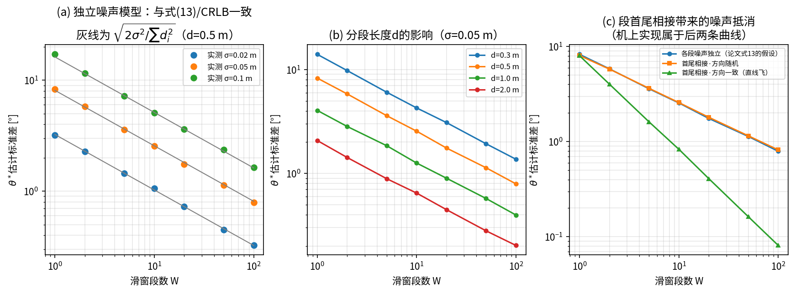
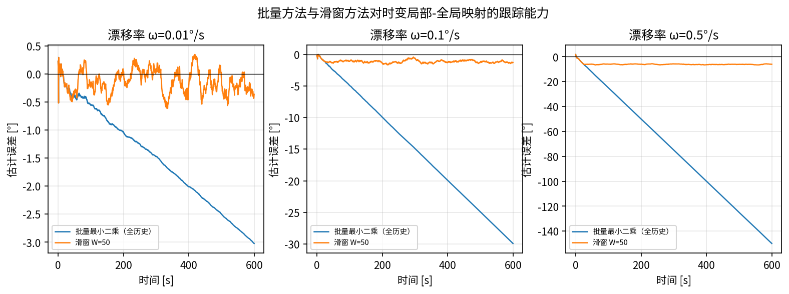
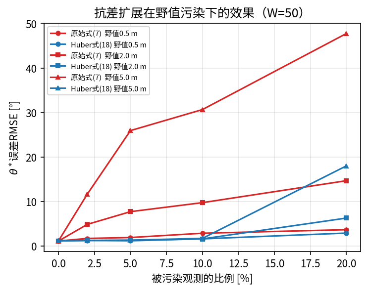

> **使用说明（不属于论文正文，合稿时删除）**
>
> 1. 本文件是润色版论文第4章的替换稿。原第4章（4.1与现有方法的比较／4.2实验环境
>    与验证方法论／4.3真机侧方法族泛化验证／4.4尚待完成的定量实验）建议整体替换为
>    下面的4.1–4.8；原4.1的表2保留，移到新的4.7；原4.3整节保留，移到新的4.8.1；
>    **原表3（尚待完成的定量实验）建议删除**，其内容已分别落到4.2–4.6的实测结果和
>    4.9的后续工作里。
> 2. 公式编号接正文式(21)往下排，新增(22)–(25)。表编号接表2往下排，新增表3–表9。
>    图编号接图4往下排，新增图5–图9。若期刊限制图表数量，表4/表5可并成一张、
>    表9可改为正文文字描述。
> 3. 4.2.2节的式(22)–(24)是本轮实验中新推出来的结果，**建议把推导本身移到2.6节**
>    （紧接现有式(13)之后），第4章只留验证数据；此处先完整写出，便于取舍。
> 4. 所有数字均来自 `docker_sim/paper_exp_results/*.csv`，插图来自同目录 `fig_*.png`，
>    复现命令见 `docker_sim/scripts/paper_exp/README.md`。
> 5. 标注【待补】的小节是仿真闭环与真机实验，代码改动已完成、等待重建镜像后执行，
>    实验设计见 `docker_sim/实验方案_SE2在线标定论文补充实验.md`。

# 4 实验与验证

本章分三个层次验证前文的方法：数值层面用蒙特卡洛实验直接检验第2节各条解析
结论（4.2–4.6节）；系统层面在双机协同无人机容器化仿真平台上做闭环验证
（4.8.2节）；硬件层面在真实机载平台上验证方法族的泛化能力与机载可行性
（4.8.1节）。4.7节给出与现有方法的对比。

## 4.1 实验设置

### 4.1.1 数值实验设置

数值实验按第2节的观测模型合成数据：给定真值航向角偏差$\theta_{0}$，按式(1)
生成局部位移段$u_{i}$，经$R(\theta_{0})$旋转后叠加观测噪声得到$v_{i}$，再送入与
机载实现完全相同的分段、滑窗累加与式(7)读数流程。除非另行说明，参数取论文表1的
标称值：$\sigma = 0.05\,\mathrm{m}$、$d_{\min} = 0.5\,\mathrm{m}$、$W = 50$、
$\theta_{0} = 30{^\circ}$；每个配置重复2000次独立试验（E3–E6因含时序过程分别取
30/400/1000/300次），统计量给出样本标准差与均值。表3汇总各项数值实验的配置。

为保证"被验证的估计器就是被部署的估计器"，数值实验直接调用从机载节点逐行抄出的
算法副本，并以一致性测试确认：在同一组含10%野值的输入上，机载实现与数值实验副本
给出的$\theta^{\ast}$差异小于$10^{-12}\,\mathrm{rad}$。

**表3 数值实验配置**

| 编号 | 检验对象 | 自变量 | 重复次数 |
|---|---|---|---|
| E1 | 式(12)(13)(15)：噪声传播与统计效率 | $W \in \{1,2,5,10,20,50,100\}$；$d \in \{0.3,0.5,1.0,2.0\}$ m；$\sigma \in \{0.02,0.05,0.10\}$ m；噪声结构∈{独立,首尾相接}；方向∈{一致,随机} | 2000 |
| E2 | 式(10)(11)：恒定全局偏置免疫性 | $\lVert b \rVert \in \{0,0.5,2.0\}$ m × 3个方向 | 500 |
| E3 | 2.5节：滑窗对时变映射的跟踪能力 | 映射漂移率 $\omega \in \{0.01,0.1,0.5\}$ °/s；对照组为批量最小二乘 | 30 |
| E4 | 式(16)(17)(18)：抗差扩展 | 野值比例 $p \in \{0,2,5,10,20\}\%$；野值幅度 $\in \{0.5,2.0,5.0\}$ m | 400 |
| E5 | 第5节：运动方向与可观测性 | 方向模式∈{单方向,多方向} × 里程计方向相关偏置 $\gamma \in \{0,0.05,0.10,0.20\}$ | 1000 |
| E6 | 观测异步的影响 | 轨迹∈{匀速直线,持续转弯}；速度 $\in \{0.3,1.0,2.0\}$ m/s；配对方式∈{理想对齐,最近帧,时间戳插值} | 300 |

### 4.1.2 仿真平台设置

方法在双机协同无人机容器化仿真平台上实现与验证。平台以Gazebo Classic提供世界
真值与传感器仿真，PX4 SITL提供飞控闭环，机载定位由激光惯性里程计（DLIO）提供，
绝对位置观测由仿真节点按世界真值叠加零均值高斯噪声产生
（$\sigma = 0.05\,\mathrm{m}$），两机的预设航向角分别为$30{^\circ}$与$-45{^\circ}$。
评估真值取自Gazebo世界状态，逐时刻计算
$\theta_{true}(t) = \psi_{world}(t) - \psi_{odom}(t)$，即把局部里程计自身的航向漂移
也计入评估基准，而非固定采用出生时的预设角度。

此处需要说明两点容易导致误判的实现细节。其一，仿真中"更新率"参数的配置值不等于
真实发布频率，需乘以仿真实时因子，该因子在双机高负载场景下实测在0.27–0.53之间
波动。其二，本平台绝对位置观测的发布路径直接挂在世界状态回调上，其真实发布率等于
世界状态插件的更新率（100 Hz仿真时间）且不经过时延队列，比真实超宽带模块（典型
10–50 Hz、数十毫秒时延）乐观；因此仿真闭环给出的精度应视为观测条件充分时的上界，
与真实硬件条件的对照需另行设置观测率与时延后重复实验。

### 4.1.3 实验设计中的一条方法论要求

早期验证曾在两机预设航向角均为零的默认场景下进行，该场景下真值$\theta$本身为零，
即使算法实现存在符号错误或系数错误，测试结果也可能看似正常。验证旋转对齐类算法
必须预先建立非零真值场景，本文全部实验据此统一采用非零真值配置。

## 4.2 噪声传播模型与统计效率验证（E1）

### 4.2.1 与式(13)及Cramér-Rao下界的对照

在各段观测噪声相互独立、位移方向随机的条件下，实测估计标准差与式(13)的理论预测
在$W$跨两个数量级的范围内一致，比值稳定在0.97–1.02之间（表4）。论文2.6节给出的
两个具体数值预测也得到确认：单段情形理论值$8.10{^\circ}$、实测$8.28{^\circ}$；
$W = 50$时理论值$1.146{^\circ}$、实测$1.133{^\circ}$。由于式(13)与式(15)给出的
Cramér-Rao下界在同一噪声模型下数值相同，该结果同时确认了本文闭式解在该模型下是
渐近有效估计量这一论断。

**表4 估计标准差的实测值与式(13)理论值对照（$\sigma = 0.05$ m，$d = 0.5$ m，各段噪声独立，方向随机，2000次重复）**

| $W$ | 1 | 2 | 5 | 10 | 20 | 50 | 100 |
|---|---|---|---|---|---|---|---|
| 实测标准差 [°] | 8.276 | 5.828 | 3.596 | 2.551 | 1.754 | 1.133 | 0.793 |
| 式(13)理论值 [°] | 8.103 | 5.730 | 3.624 | 2.562 | 1.812 | 1.146 | 0.810 |
| 实测/理论 | 1.021 | 1.017 | 0.992 | 0.996 | 0.968 | 0.989 | 0.978 |

式(13)预言标准差与$\sigma$成正比、与$\sqrt{\sum d_i^2}$成反比，二者在实验中同样
成立：固定$W = 50$、$d = 0.5\,\mathrm{m}$，$\sigma$取0.02/0.05/0.10 m时实测标准差
为$0.451{^\circ}$/$1.133{^\circ}$/$2.365{^\circ}$（理论$0.458{^\circ}$/
$1.146{^\circ}$/$2.292{^\circ}$）；固定$\sigma = 0.05\,\mathrm{m}$，$d$取
0.3/0.5/1.0/2.0 m时实测为$1.929{^\circ}$/$1.133{^\circ}$/$0.573{^\circ}$/
$0.280{^\circ}$（理论$1.910{^\circ}$/$1.146{^\circ}$/$0.573{^\circ}$/
$0.286{^\circ}$）。结果见图5(a)(b)。

### 4.2.2 位移段首尾相接引起的噪声相消

2.6节末尾曾指出，若相邻位移段共享同一次绝对观测作为端点，相邻段噪声将呈现负
相关，式(13)(15)应视为忽略该相关性的一阶近似。本文的分段策略正是首尾相接的
（每段终点即下一段起点），因此有必要给出该相关性的定量结果。

设绝对观测序列为$p_{0},\ldots,p_{W}$，各含独立噪声$n_{k}$，则
$v_{i} = (p_{i} + n_{i}) - (p_{i-1} + n_{i-1})$。代入式(6)中$S$的定义并做Abel求和：

$S_{noise} = \sum_{i=1}^{W} u_i \times (n_i - n_{i-1}) = \sum_{i=1}^{W-1}(u_i - u_{i+1}) \times n_i + u_W \times n_W - u_1 \times n_0$ (22)

在$C \approx \sum_i d_i^2$的一阶近似下，得到计入端点共享后的估计方差：

$Var(\widehat{\theta}) \approx \frac{\sigma^{2}\left[\sum_{i=1}^{W-1}\lVert u_i - u_{i+1}\rVert^{2} + \lVert u_1 \rVert^{2} + \lVert u_W \rVert^{2}\right]}{\left(\sum_i d_i^{2}\right)^{2}}$ (23)

式(23)包含两个有意义的极限。位移方向随机时
$\mathbb{E}\lVert u_i - u_{i+1}\rVert^{2} = 2d^{2}$，代入后化简即回到式(13)，说明
式(13)在方向多样的运动下仍然准确。位移方向一致（沿直线运动）时
$u_i - u_{i+1} = 0$，求和项整体消失，只剩两个端点项：

$Var(\widehat{\theta}) \approx \frac{2\sigma^{2}}{\left(\sum_i d_i\right)^{2}}$ (24)

即方差由"单段位移平方和"改由"总位移的平方"决定，比式(13)小$W$倍，标准差小
$\sqrt{W}$倍——窗口内部各次观测的噪声两两抵消，只有首尾两次观测的噪声进入结果，
估计的等效基线是整条轨迹的总位移而非单段位移。表5给出实测确认：$W = 50$、
$d = 0.5\,\mathrm{m}$、方向一致时实测标准差$0.162{^\circ}$，式(24)预测
$0.162{^\circ}$，而式(13)预测$1.146{^\circ}$，二者相差7.1倍，与$\sqrt{50} = 7.07$
一致。

这一结果不与式(15)的Cramér-Rao下界矛盾：式(15)是在"各段噪声相互独立"这一模型下
导出的，而首尾相接的实际观测模型中噪声相关，对应的Fisher信息本就更大，下界更低。
换言之，式(13)(15)是本文方法精度的**保守**估计，实际部署中若运动方向较为一致，
精度会显著优于该预测。

**表5 位移段首尾相接对估计精度的影响（$W = 50$，$d = 0.5$ m，$\sigma = 0.05$ m，2000次重复）**

| 噪声结构 | 位移方向 | 实测标准差 [°] | 式(13) [°] | 式(23) [°] |
|---|---|---|---|---|
| 各段独立 | 随机 | 1.133 | 1.146 | 1.146 |
| 首尾相接 | 随机 | 1.151 | 1.146 | 1.146 |
| 首尾相接 | 一致 | 0.162 | 1.146 | 0.162 |

图5 噪声传播与统计效率验证。(a) 独立噪声模型下实测标准差与式(13)/CRLB理论曲线
（灰线）的对照；(b) 分段长度$d$的影响；(c) 位移段首尾相接引起的噪声相消，机载
实现对应后两条曲线

## 4.3 恒定全局偏置免疫性验证（E2）

按2.4节的模型，在绝对观测上叠加恒定偏置$b$，取$\lVert b \rVert \in \{0,0.5,2.0\}
\,\mathrm{m}$、方向分别为$0{^\circ}$/$90{^\circ}$/$217{^\circ}$共9组配置。全部
配置下旋转估计$\theta^{\ast}$相对无偏置基准的偏差均为数值零（$0.000 \times
10^{0}\,{^\circ}$，即浮点意义下的精确抵消），验证了式(10)所述的结构性免疫；同时
平移分量的误差恒等于$\lVert b \rVert$本身（分别为0/0.500000/2.000000 m），验证了
式(11)所述"平移原样继承偏置"。该性质由差分式估计器的结构决定，与偏置的大小和
方向无关，不需要任何额外处理。

## 4.4 与批量最小二乘的对比（E3）

批量方法用全部历史位移段一次性求解，样本量随时间单调增长，在映射关系恒定时稳态
精度不劣于滑窗方法；本文采用滑窗的理由是局部-全局映射会随局部里程计的缓慢漂移
而时变。为定量比较二者的跟踪能力，令真值按$\theta_{true}(t) = \theta_{0} +
\omega t$线性漂移，飞行速度$1\,\mathrm{m/s}$（即每段耗时$\Delta t = 0.5\,
\mathrm{s}$），总时长600 s，对比滑窗（$W = 50$）与批量方法的估计误差。

滑窗方法的稳态误差有解析预期：窗口内数据的平均"年龄"为$(W - 1)\Delta t / 2$，
故稳态滞后

$\mathbb{E}\left[\widehat{\theta} - \theta_{true}\right] \approx -\,\omega\,(W-1)\Delta t\,/\,2$ (25)

与时间无关、有界；批量方法的窗口是全历史，平均年龄为$t/2$，滞后随时间线性发散。
表6的实测结果与该预期一致：$\omega = 0.1{^\circ}/\mathrm{s}$时滑窗稳态误差
$-1.16{^\circ}$（式(25)预测$-1.23{^\circ}$），批量方法在600 s末累积到
$-25.41{^\circ}$；均方根误差分别为$1.62{^\circ}$与$25.55{^\circ}$，相差约16倍。
图6给出三种漂移率下的误差时间曲线，批量方法的误差曲线是一条持续下降的直线，
不存在稳态。

即便在$\omega = 0.01{^\circ}/\mathrm{s}$（每分钟$0.6{^\circ}$）这一相当缓慢的漂移
率下，批量方法在10分钟飞行内的误差也已累积到$-2.55{^\circ}$、超过噪声水平，而滑窗
方法的误差仍被噪声主导（稳态偏差$-0.19{^\circ}$，均方根误差$1.19{^\circ}$，与
表4中$W = 50$的$1.133{^\circ}$一致）。这说明滑窗结构的必要性不取决于漂移是否剧烈，
而取决于任务时长：只要映射关系存在任何非零漂移，批量方法的误差最终都会超过滑窗
方法，且超出时刻随漂移率减小而推迟、但不会消失。

**表6 批量方法与滑窗方法在时变映射下的误差（$W = 50$，飞行600 s，30次重复，取后30%时段统计）**

| 映射漂移率 $\omega$ [°/s] | 滑窗稳态误差 [°] | 式(25)预测 [°] | 滑窗RMSE [°] | 批量稳态误差 [°] | 批量RMSE [°] |
|---|---|---|---|---|---|
| 0.01 | −0.19 | −0.12 | 1.19 | −2.55 | 2.58 |
| 0.10 | −1.16 | −1.23 | 1.62 | −25.41 | 25.55 |
| 0.50 | −6.16 | −6.12 | 6.27 | −127.44 | 128.11 |

图6 批量方法与滑窗方法对时变局部-全局映射的跟踪能力

## 4.5 抗差扩展验证（E4）

按2.7节的模型，以概率$p$对绝对观测叠加幅度为$m$、方向随机的野值。由于位移段首尾
相接，一次被污染的观测会同时影响相邻两段，与真实系统中的传播方式一致。对比原始
闭式解式(7)与Huber重加权式(18)（$k = 3\times\mathrm{MAD}$，3次迭代）的估计误差，
结果见表7与图7。

无野值时抗差扩展的效率代价很小：均方根误差由$1.18{^\circ}$增至$1.22{^\circ}$，
相对损失约3%，与Huber估计量在高斯情形下的理论效率损失量级相符。存在野值时改善
显著：10%的观测被5 m野值污染时，原始解的均方根误差达$30.66{^\circ}$，抗差解为
$1.74{^\circ}$，改善约17倍；此时95%分位误差由$62.36{^\circ}$降至$3.46{^\circ}$。
野值幅度越大改善越明显——这与2.7节的分析一致：式(6)的隐式权重正比于
$\lVert u_i \rVert \cdot \lVert v_i \rVert$，被污染段的$\lVert v_i \rVert$更大、
反而获得更大权重，野值幅度越大这一错误加权越严重，而Huber权重恰好抵消这一机制。

抗差扩展存在崩溃点：污染比例达到20%时，$\mathrm{MAD}$尺度估计本身已被野值抬高，
均方根误差回升至$6.30{^\circ}$（2 m野值）与$18.02{^\circ}$（5 m野值），不再能保证
可用精度。这一边界与Huber型M估计的已知性质一致，实用中应把20%视为该方案的适用
上限，超出时需要改用高崩溃点估计量（如最小中位平方）或在观测端先做门限剔除。

**表7 抗差扩展在野值污染下的估计误差（$W = 50$，400次重复）**

| 野值幅度 [m] | 野值比例 | 原始式(7) RMSE [°] | Huber式(18) RMSE [°] | 原始 p95 [°] | Huber p95 [°] |
|---|---|---|---|---|---|
| — | 0% | 1.18 | 1.22 | 2.40 | 2.55 |
| 0.5 | 10% | 2.89 | 1.63 | 5.70 | 3.05 |
| 2.0 | 5% | 7.74 | 1.32 | 15.23 | 2.67 |
| 2.0 | 10% | 9.76 | 1.62 | 18.80 | 3.00 |
| 5.0 | 2% | 11.67 | 1.26 | 27.28 | 2.55 |
| 5.0 | 5% | 25.94 | 1.35 | 44.68 | 2.67 |
| 5.0 | 10% | 30.66 | 1.74 | 62.36 | 3.46 |
| 5.0 | 20% | 47.73 | 18.02 | 95.08 | 12.70 |

图7 抗差扩展在不同野值比例与幅度下的效果（$W = 50$）

## 4.6 运动方向与可观测性（E5）

第5节提出两条论断：纯噪声情形下估计方差只取决于$\sum_i d_i^2$、与方向多样性无关；
但若局部里程计存在方向相关的系统性偏置，单一方向的位移段无法将该偏置与真实旋转角
区分开。本节对两条论断分别给出定量验证。

方向相关偏置用剪切矩阵$A = \begin{pmatrix}1 & \gamma\\ 0 & 1\end{pmatrix}$建模，
里程计读数为$u_i^{meas} = A\,u_i$：沿局部$x$轴运动时不受影响，沿局部$y$轴运动时被
扭转$\arctan\gamma$，即"偏置引起的等效角度"本身依赖运动方向。判据取两条：
$\theta^{\ast}$的系统偏差（偏置被误当作旋转角吸收的部分），以及残差均方根相对纯
噪声水平$2\sigma$的抬升（模型失配能否被观测到）。

结果见表8与图8。$\gamma = 0$时单方向与多方向的估计标准差分别为$1.13{^\circ}$与
$1.17{^\circ}$，在统计误差内相同，论断一成立。存在偏置时，单方向运动下
$\theta^{\ast}$的系统偏差恰好等于$\arctan\gamma$（$\gamma = 0.20$时实测
$+11.29{^\circ}$，$\arctan\gamma = 11.31{^\circ}$），且残差始终停在噪声水平
（比值0.99–1.00）——偏置被完全吸收进$\theta$，从数据内部**无法察觉**其存在。多方向
运动下同一偏置只造成约一半的系统偏差（$+5.71{^\circ}$），且残差抬升到噪声水平的
1.11倍，模型失配开始在残差中显现。这一对照定量说明：方向多样性的作用不是降低
噪声引起的方差，而是把"里程计系统性偏置"与"真实旋转角"这两个原本混淆的量分开，
并使前者变得可检测。工程上可据此把残差均方根相对$2\sigma$的比值作为在线自检指标。

**表8 运动方向多样性与里程计方向相关偏置的交互（$W = 50$，$\sigma = 0.05$ m，1000次重复）**

| 方向模式 | $\gamma$ | $\theta^{\ast}$系统偏差 [°] | $\arctan\gamma$ [°] | 标准差 [°] | 残差RMS/噪声水平 |
|---|---|---|---|---|---|
| 单方向 | 0 | +0.02 | 0 | 1.13 | 0.99 |
| 单方向 | 0.05 | +2.90 | 2.86 | 1.12 | 0.99 |
| 单方向 | 0.10 | +5.67 | 5.71 | 1.13 | 1.00 |
| 单方向 | 0.20 | +11.29 | 11.31 | 1.17 | 1.00 |
| 多方向 | 0 | −0.00 | 0 | 1.17 | 0.99 |
| 多方向 | 0.05 | +1.40 | 2.86 | 1.18 | 1.00 |
| 多方向 | 0.10 | +2.89 | 5.71 | 1.19 | 1.02 |
| 多方向 | 0.20 | +5.71 | 11.31 | 1.34 | 1.11 |

图8 运动方向多样性与可观测性。(a) 里程计方向相关偏置被误当作旋转角吸收的程度；
(b) 模型失配在残差中的可检测性

## 4.7 观测异步的影响（E6）

本文的估计器在构造$v_i$时取局部里程计更新时刻"最近一帧"绝对观测，未做时间戳对齐。
绝对定位源的发布率有限且存在处理时延，端点数据的陈旧程度因而在一个发布周期内
随机抖动，这一项未包含在式(12)(13)的噪声模型中。本节以10 Hz发布率、30 ms固定时延
为设置，对比三种取数方式：理想时间对齐（同时刻真值加噪声）、最近一帧（本文实现）
与时间戳线性插值，轨迹分匀速直线与持续转弯两类，速度取0.3/1.0/2.0 m/s。

结果（表9）显示，最近一帧与理想对齐的均方根误差几乎相同（$0.156$–$0.161{^\circ}$
对$0.151$–$0.176{^\circ}$），仅在持续转弯且速度1 m/s时出现$-0.092{^\circ}$的系统
偏差。原因可由式(22)(23)解释：观测陈旧表现为绝对观测的位置域误差，与测量噪声一样
出现在共享端点上，因而在首尾相接的差分结构中被同样地抵消，只有轨迹曲率破坏这一
抵消时才留下残差。相反，时间戳线性插值反而使误差增大到$0.25$–$0.37{^\circ}$：插值
混合了两帧观测的独立噪声，并破坏了相邻段共享端点这一相消结构。据此本文保留"最近
一帧"的实现，不引入时间戳对齐。

**表9 观测异步对估计精度的影响（10 Hz发布率、30 ms时延，300次重复，均方根误差[°]）**

| 轨迹 | 速度 [m/s] | 理想时间对齐 | 最近一帧（本文） | 时间戳插值 |
|---|---|---|---|---|
| 匀速直线 | 0.3 | 0.151 | 0.158 | 0.252 |
| 匀速直线 | 1.0 | 0.168 | 0.161 | 0.367 |
| 匀速直线 | 2.0 | 0.158 | 0.160 | 0.288 |
| 持续转弯 | 0.3 | 0.152 | 0.156 | 0.254 |
| 持续转弯 | 1.0 | 0.177 | 0.196 | 0.328 |
| 持续转弯 | 2.0 | 0.154 | 0.156 | 0.274 |

图9 观测异步对估计精度的影响（绝对观测10 Hz、时延30 ms）

## 4.8 与现有方法的比较

（此处保留原4.1节全文与表2，仅补充下段）

表2从问题结构、观测源、求解方式三个维度比较本文方法与代表性相关工作。在此基础上，
4.4节给出了与批量最小二乘的定量对比：在映射关系时变的条件下，批量方法的误差随
任务时长线性发散，而滑窗方法的误差有界且可由式(25)预测。与传统超宽带多基站三边
定位相比，本文仅要求单一绝对位置源，且由4.2.2节可知精度随运动累积而提升，不受
锚点几何布局（GDOP）约束。与点云配准方法相比，本文方法为滑窗内的标量代数运算，
不依赖点云重叠。

## 4.9 硬件与系统层验证

### 4.9.1 真机侧方法族泛化验证

（此处保留原4.3节全文，包括双标签几何反正切测向、式(21)的基线测向噪声分析，
以及"运动累积的时间基线替代物理空间基线"这一对照论证。）

### 4.9.2 仿真闭环验证【待补】

以下实验的平台改造已完成（真值旁路发布、观测污染注入、观测率与时延可配、预设
航向角可配、抗差开关、目标点持续重变换开关），待执行：

- **收敛精度主实验**：两机在$30{^\circ}$/$-45{^\circ}$预设航向角下完成起飞与自标定
  机动，记录$\theta^{\ast}(t)$与逐时刻真值的误差，重复10次给出均值与标准差，
  用于替换2.6节"与实测滑窗收敛后1°–2°量级吻合"这一目前无数据支撑的表述。
- **真值角度全域扫描**：$\theta_{0}$取$0{^\circ}$至$180{^\circ}$共8个值，验证估计器
  在全角域不存在符号或象限错误。
- **3.2节修复的效果验证**：目标点消费端改为持续跟踪全局系原始目标、每次
  $\theta^{\ast}$更新后重新变换并重发局部目标，对比修复前后双机对穿测试的落点
  偏差，把3.2节的证据链补成"发现—定量预测—修复—验证"的完整闭环。
- **多机链式复合误差**：由两机各自标定出的$(\theta^{\ast},t)$复合出机间相对位姿，
  与仿真真值对照，量化1.1节"多机部署仅需并行调用与一次坐标复合"这一论断。
- **观测污染的闭环验证与观测率敏感性**：在闭环中复现4.3、4.5节的偏置与野值场景，
  并将绝对观测限制到10 Hz、30 ms时延，与4.1.2节所述的乐观设置做对照。

### 4.9.3 机载计算开销【待补】

方法每次更新的计算量为滑窗内的$O(W)$标量运算（不开抗差时为$O(1)$增量更新），
拟在Jetson Orin NX平台上实测单次更新耗时与进程资源占用，以支撑机载可行性论断。

---

# 附：需要同步修改的其它章节

1. **2.6节**：建议把4.2.2节的式(22)(23)(24)及其推导移到此处，紧接现有式(13)之后，
   把原来那句"若相邻位移段共享同一次绝对观测作为端点……应视为忽略该相关性的一阶
   近似"替换为完整结论；第4章只保留验证数据。同时把"与实测滑窗收敛后1°–2°量级
   吻合"改为引用4.2.1节的数值结果，待4.9.2节完成后再补仿真闭环实测值。
2. **2.7节末尾**："该扩展目前仅完成设计，尚未开展仿真验证，列入表3"一句应删除，
   改为指向4.5节的数值验证结果，并补上崩溃点（污染比例20%）这一适用边界。
3. **摘要与6.1节**：抗差扩展的表述可由"设计了……方案"提升为"设计并数值验证了……
   方案"；在4.9.2节完成前不宜声称已在闭环中验证。
4. **表3（尚待完成的定量实验）**：删除。其中批量对比、参数敏感性、抗差验证三项
   已完成（4.4、4.2、4.5节），读取端修复验证移入4.9.2节的待补清单。
5. **6.2节局限**：可补充两点——式(23)表明本文精度界依赖运动方向分布，方向一致时
   实际精度优于式(13)的保守预测；4.7节的观测异步项在轨迹曲率较大时会引入约
   $0.1{^\circ}$量级的系统偏差，当前实现未做补偿。
